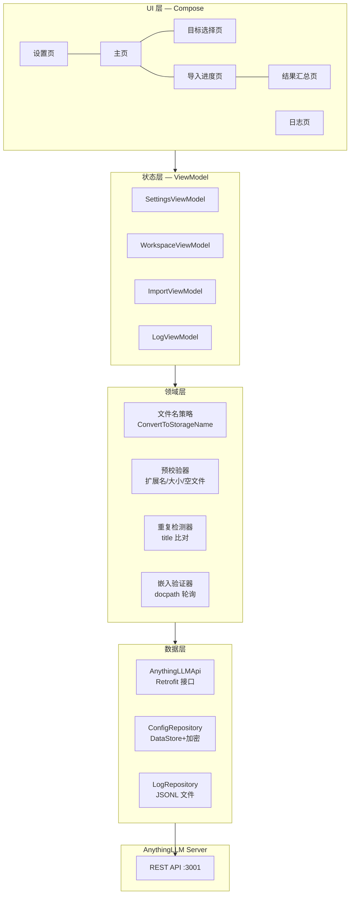
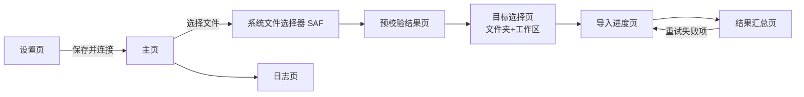
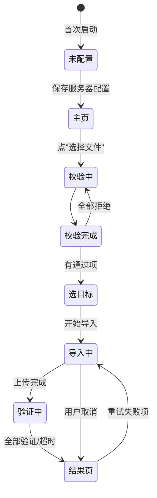

# AnythingLLM 批量导入工具(Android 版)— 开发文档

| 项 | 值 |
|---|---|
| 文档版本 | v1.0(待审阅) |
| 编制日期 | 2026-09-10 |
| 状态 | 待审阅 |
| 关联项目 | PC 版:`003anythingllmtools`(PowerShell `embed.ps1` v0.9) |
| 审阅后执行 | 按本文件 + 《02-开发计划.md》实施 |

---

## 1. 项目概述

### 1.1 背景

PC 端已有一套"AnythingLLM 文档嵌入工具"(Windows PowerShell):拖入文件 → 选择文档文件夹 → 选择工作区 → 上传并嵌入 → 轮询验证。本项目的目标是把这套批量导入能力**原样移植到 Android**,让用户直接拿手机从本机存储选择文件,批量上传到局域网内的 AnythingLLM 实例并嵌入工作区。

### 1.2 目标

- 功能与 PC 版 **1:1 对齐**:两段式传入(先文档文件夹、后工作区)、统一/逐项两种模式、中文文件名 ASCII 化、重复检测、上传重试、嵌入轮询验证。
- 适配移动端:系统文件选择器(SAF)、设置页代替 config.json、进度可视化、结果汇总。
- 最低支持 Android 8.0(minSdk 26)。

### 1.3 非目标(明确不做)

- 不做文档在线阅读/编辑/管理界面。
- 不做 AnythingLLM 服务端安装、部署、升级。
- 不做多服务器切换的复杂管理(单服务器即可,可随时改地址)。
- 不涉及 PC 版退出码语义(Android 用 UI 状态表达)。

---

## 2. 环境基线(已完成部署)

| 组件 | 版本/路径 | 状态 |
|---|---|---|
| JDK | Temurin 17.0.20.1 → `D:\WSL\SDK\jdk-17.0.20.1+1` | ✅ |
| Android Studio | 2026.1.4.7 → `D:\WSL\SDK\android-studio` | ✅ |
| Android SDK | `D:\WSL\SDK\Android`(platform-tools 37.0.1 / build-tools 37.0.0 / platforms android-36 / cmdline-tools) | ✅ |
| Gradle | 8.14(全局 + Wrapper,腾讯镜像) | ✅ |
| 模拟器 | AVD `anythingllm_api36`(Android 36, x86_64, WHPX 加速) | ✅ 运行中 |
| 项目目录 | `D:\WSL\object\AnythingLLM-Android` | ✅ |
| 镜像源 | JDK=清华 / SDK+Gradle=腾讯 / Maven=阿里云 | ✅ |
| AnythingLLM | 本机 `localhost:3001`,已转发路由,局域网可访问 | ✅ |
| API Key | 项目根 `apikey.txt`(31 字符,已入 .gitignore) | ✅ |

---

## 3. 需求规格

### 3.1 核心场景

1. **日常批量导入**:手机选 N 个文档 → 全放同一文件夹 + 同一工作区 → 一键导入(统一模式)。
2. **精细归位**:每个文件分别指定文件夹/工作区 → 统一嵌入(逐项模式)。
3. **连接配置**:首次使用填写服务器地址 + API Key,可随时修改;支持连通性检测。
4. **结果追溯**:导入结束后查看成功/失败/跳过明细,失败可重试;日志可查看导出。

### 3.2 功能需求清单

| 编号 | 功能 | 描述 | 优先级 |
|---|---|---|---|
| FR-01 | 服务器配置 | 服务器地址(baseUrl)、API Key、探活(区分"不可达/Key 无效/正常") | P0 |
| FR-02 | 参数配置 | 上传/嵌入/验证超时、允许扩展名白名单、文件大小上限、文件名策略(unicode/strip/keep)、重复检测开关与默认动作 | P0 |
| FR-03 | 文件选择 | SAF 系统文件选择器**多选**;显示所选文件列表(名称/大小/类型) | P0 |
| FR-04 | 预校验 | 扩展名白名单、大小上限、空文件过滤;给出通过/拒绝清单 | P0 |
| FR-05 | 工作区管理 | 从 API 拉取工作区列表、关键字搜索、默认工作区记忆 | P0 |
| FR-06 | 文档文件夹 | 列出现有文件夹、创建新文件夹(空文件夹删除可选,仅空目录) | P0 |
| FR-07 | 导入模式 | 统一模式(全部→同一文件夹+工作区)/ 逐项模式(每文件单独选择) | P0 |
| FR-08 | 上传 | multipart 上传(与 PC 版字节级一致);单文件进度;指数退避重试(2 次) | P0 |
| FR-09 | 中文文件名 | 上传前 `uXXXX` ASCII 化,中文原名写入 metadata.title(与 PC 版一致) | P0 |
| FR-10 | 重复检测 | 按 title 比对服务端已存文档;动作:全部保留/跳过/替换/中止(可批量应用) | P0 |
| FR-11 | 嵌入与验证 | 触发 `update-embeddings`;按 docpath 轮询工作区详情验证(退避间隔 2s→5s) | P0 |
| FR-12 | 结果汇总 | 成功/失败/跳过三类汇总;失败原因列表;单条/全部重试 | P0 |
| FR-13 | 日志 | 本地 JSONL 日志(同 PC 版结构),可查看/导出/清理;保留 30 天 | P1 |
| FR-14 | 测试检索 | 可选:导入后向工作区发 query 聊天,验证可检索(默认关闭) | P1 |
| FR-15 | 深色模式 | 跟随系统 / 手动切换 | P2 |
| FR-16 | 服务器状态 | 主页显示当前服务器连通状态与工作区数量 | P1 |

### 3.3 非功能需求

| 类别 | 要求 |
|---|---|
| 性能 | 单个 100MB 文件上传不卡 UI(协程 + 分片读流);列表滑动流畅 |
| 安全 | API Key 加密存储(EncryptedSharedPreferences/Keystore);日志不记录 Key |
| 兼容 | minSdk 26;模拟器 + 真机双端验证 |
| 可用性 | 全程可取消;网络失败给出可理解错误与重试入口;中文界面 |
| 隐私 | 不采集任何数据;所有流量直达用户自己的服务器 |

---

## 4. 技术方案

### 4.1 技术栈

| 项 | 选择 | 理由 |
|---|---|---|
| 语言 | Kotlin 2.0.21 | Android 官方语言 |
| UI | Jetpack Compose + Material 3(BOM 2024.12.01) | 声明式,列表/表单/进度友好 |
| 编译 | compileSdk 36 / targetSdk 36 / minSdk 26 | 已装 android-36 平台 |
| 构建 | Gradle 8.14 + AGP 8.9.1,Kotlin DSL | 已部署,Wrapper 走腾讯镜像 |
| 网络 | Retrofit + OkHttp + kotlinx.serialization | 与 PC 版 HttpClient 语义对应 |
| 配置存储 | DataStore(非敏感)+ EncryptedSharedPreferences(API Key) | 对应 config.json + apikey.txt |
| 异步 | Coroutines + Flow | 长任务/轮询/并发上传 |
| 文件选择 | Storage Access Framework(SAF)多选 | 免存储权限 |
| 导航 | Navigation Compose | 页面流转 |

### 4.2 总体架构



### 4.3 包结构

```
com.anythingllm.importer/
├── MainActivity.kt
├── data/
│   ├── api/          # Retrofit 接口、DTO、multipart 构造
│   ├── config/       # ConfigRepository、加密 Key 存储
│   ├── log/          # JSONL 日志写入/读取/清理
│   └── model/        # 数据模型
├── domain/
│   ├── filename/     # ConvertToStorageName(与 PC 版一致)
│   ├── validate/     # 预校验
│   ├── duplicate/    # 重复检测
│   └── embed/        # 上传队列、重试、嵌入验证轮询
├── ui/
│   ├── settings/     # 设置页
│   ├── home/         # 主页
│   ├── select/       # 文件/目标选择
│   ├── import/       # 导入进度
│   ├── result/       # 结果汇总
│   └── logs/         # 日志页
└── util/             # 扩展函数、格式化
```

### 4.4 关键实现约束(与 PC 版对齐)

1. **multipart 字节级一致**:`metadata` 文本字段必须放在 `file` 字段之前(服务端 multer 只解析 file 之前的文本字段);boundary 用随机 GUID;file 的 `filename` 必须是转换后的存储名。
2. **文件名转换算法逐字符一致**(见 5.4)。
3. **嵌入验证按 docpath 匹配**(upload 返回的 location 与 workspace 详情的 docpath 一致)。
4. **上传端点两条路径**:指定工作区 → `/api/v1/workspace/{slug}/upload`;仅文件夹 → `/api/v1/document/upload/{folder}`(默认 `custom-documents`)。

---

## 5. API 对接设计(AnythingLLM)

### 5.1 认证与约定

- 请求头:`Authorization: Bearer {API_KEY}`。
- baseUrl 来自设置(默认 `http://10.0.2.2:3001` 便于模拟器直连宿主机;真机用局域网 IP)。
- JSON 请求体为 UTF-8;上传为 multipart/form-data。

### 5.2 端点清单

| # | 方法 | 路径 | 用途 | 请求要点 | 响应要点 |
|---|---|---|---|---|---|
| 1 | GET | `/api/ping` | 探活(无需 Key) | — | 200 即服务在线 |
| 2 | GET | `/api/v1/auth` | 验证 Key 有效性 | Bearer | 200=有效 |
| 3 | GET | `/api/v1/workspaces` | 工作区列表 | — | `{workspaces:[{slug,name,...}]}` |
| 4 | POST | `/api/v1/workspace/new` | 创建工作区(可选) | `{name}` | 工作区对象 |
| 5 | GET | `/api/v1/workspace/{slug}` | 工作区详情(验证用) | — | `{workspace:{documents:[{docpath,...}]}}` |
| 6 | GET | `/api/v1/documents` | 文档树/查重/文件夹列表 | — | `{localFiles:{items:[{type:folder,...}]}}` |
| 7 | POST | `/api/v1/document/create-folder` | 创建文档文件夹 | `{name}` | — |
| 8 | DELETE | `/api/v1/document/remove-folder` | 删除**空**文件夹 | `{name}` | — |
| 9 | POST | `/api/v1/workspace/{slug}/upload` | 上传并进工作区 | multipart(5.3) | `{location}` |
| 10 | POST | `/api/v1/document/upload/{folder}` | 上传到文档文件夹 | multipart(5.3),folder URL 编码 | `{location}` |
| 11 | POST | `/api/v1/workspace/{slug}/update-embeddings` | 触发嵌入/解关联 | `{adds:[...],deletes:[...]}` | — |
| 12 | DELETE | `/api/v1/system/remove-documents` | 物理删除(替换场景) | `{names:[...]}` | — |
| 13 | POST | `/api/v1/workspace/{slug}/chat` | 测试检索(query) | `{message,mode:"query",stream:false}` | `{textResponse,sources}` |

> 注:替换旧文档采用"update-embeddings 解关联为主、物理删除为辅"两步回退,与 PC 版一致(避免官方 remove-documents 假成功问题)。

### 5.3 上传协议(与 PC 版一致)

multipart/form-data 顺序:

```
--{boundary}
Content-Disposition: form-data; name="metadata"

{"title":"原始文件名.txt"}
--{boundary}
Content-Disposition: form-data; name="file"; filename="{storageName}"
Content-Type: application/octet-stream

<文件字节流>
--{boundary}--
```

- `metadata.title` = **原始**文件名(中文原名,保证 embedding 的 sourceDocument 显示中文)。
- `file.filename` = 转换后**存储名**(ASCII 安全)。
- 大文件流式读取,避免整体载入内存。

### 5.4 文件名转换算法 `ConvertToStorageName`

与 PC 版逐字符一致(Kotlin 移植):

```
输入: name, policy(unicode 默认 / strip / keep)
1. 若 policy=keep → 原样返回
2. 拆分 ext(扩展名) 与 base(主名)
3. 对 base 逐字符:
   - 0x20 ≤ code ≤ 0x7E(可打印 ASCII)→ 保留
   - 其他(中文等)→ policy=unicode 时追加 "u{code:x4}"(小写十六进制)
                          policy=strip 时丢弃
4. 若结果为空 → "file-" + GUID 前 8 位
5. 移除字符 `"` 与 `\`(替换为 -)
6. 返回 结果 + ext
```

示例:`需求文档.txt`(unicode)→ `u9700u6c42u6587u6863.txt`;`报告_v2.txt` → `报告_v2.txt`(纯 ASCII 不变)。

### 5.5 嵌入验证轮询

- 触发:`POST /api/v1/workspace/{slug}/update-embeddings`(body 含 adds 列表)。
- 验证:轮询 `GET /api/v1/workspace/{slug}`,从 `workspace.documents[].docpath` 中匹配 upload 返回的 `location`(忽略大小写)。
- 参数:超时 300s(可配),初始间隔 2s,间隔按 ×1.5 增长,封顶 5s。
- 全部匹配=验证通过;超时未全 → 列为待验证项,提示手动确认。

### 5.6 重复检测

- 数据源:`GET /api/v1/documents` 的文档树,按**原始 title** 比对(不比对 storageName)。
- 命中动作:保留全部(继续上传)/ 跳过 / 替换(删除旧文档后上传)/ 中止。
- 默认动作可在设置配置;批量可一次应用。

### 5.7 错误分类与 UI 呈现

| 场景 | 检测方式 | UI 呈现 |
|---|---|---|
| 服务器不可达 | `/api/ping` 超时/连接失败 | "无法连接服务器,请检查地址与网络" |
| Key 无效 | `/api/v1/auth` 非 200 | "API Key 无效" |
| 文件被拒 | 预校验 | 拒绝清单 + 原因 |
| 上传失败 | 非 2xx / 超时 | 单文件标记失败 + 自动重试(2 次退避) |
| 嵌入超时 | 轮询超时 | 标记"待确认",提供重新验证 |

### 5.8 网络配置

- Android 默认禁明文 HTTP:在 manifest 声明 `usesCleartextTraffic="true"`(仅对局域网 HTTP 场景)或使用 networkSecurityConfig 仅放行指定域名,后续支持 HTTPS 时收紧。
- OkHttp 超时映射 config.json:connect 5s / upload 300s / embed 120s / api 60s / chat 300s,全部可配。

---

## 6. 配置与数据模型

### 6.1 配置项(对应 config.json,全部可在设置页修改)

| 键 | 默认值 | 说明 |
|---|---|---|
| baseUrl | `http://10.0.2.2:3001` | 服务器地址(PC 版默认 localhost:3001,Android 改局域网) |
| apiKey | 空 | 来自 apikey.txt,加密存储 |
| allowedExtensions | .pdf/.docx/.doc/.txt/.md/.csv/.xlsx/.pptx/.org/.adoc/.rst/.json/.html/.odt/.odp | 白名单 |
| maxFileSizeMB | 100 | 大小上限 |
| filenamePolicy | unicode | unicode / strip / keep |
| detectDuplicates | true | 重复检测开关 |
| duplicateDefaultAction | ask | ask / keep / skip / replace / abort |
| defaultWorkspace | 空 | 默认工作区(记忆上次) |
| uploadRetryCount / BaseDelay | 2 / 2s | 重试策略 |
| verify 参数 | timeout 300s, base 2s, max 5s | 嵌入验证 |
| 各超时 | probe 5 / upload 300 / embed 120 / api 60 / chat 300 | 秒 |
| askForChatTest | false | 完成后是否测试检索 |
| logRetentionDays | 30 | 日志保留 |

### 6.2 本地存储

- **非敏感配置**:DataStore(Preferences)。
- **API Key**:EncryptedSharedPreferences(Android Keystore 主密钥),绝不落明文日志。
- **日志**:`filesDir/logs/import-YYYYMMDD.jsonl`,追加写,JSON 行结构与 PC 版一致(时间/动作/文件/结果/错误)。

### 6.3 导入任务模型

```
ImportTask(
  id, fileUri, fileName, sizeBytes,
  storageName,          // 5.4 转换后
  folder, workspaceSlug,// 目标(逐项模式每任务独立)
  status: PENDING/CHECKING/UPLOADING/EMBEDDING/VERIFIED/FAILED/SKIPPED/ABORTED,
  error, retryCount, uploadedBytes, location
)
```

---

## 7. UI/UX 设计

### 7.1 页面与导航



### 7.2 主流程状态机



### 7.3 页面要点

| 页面 | 关键元素 |
|---|---|
| 设置页 | 服务器地址、API Key(掩码)、测试连接按钮、高级参数(超时/白名单/策略/重复动作)、保存 |
| 主页 | 服务器状态卡片、工作区数量、导入入口、日志入口 |
| 预校验结果 | 通过/拒绝分区,通过数、总大小,拒绝原因 |
| 目标选择 | 模式切换(统一/逐项)、文件夹列表+新建、工作区列表+搜索;逐项模式显示"当前文件"指示 |
| 导入进度 | 总进度条、每文件卡片(状态图标/进度/当前阶段)、暂停/取消;重复命中时弹对话框(保留/跳过/替换/中止,可"应用到全部") |
| 结果汇总 | 成功/失败/跳过计数,失败列表+原因,重试按钮,查看日志 |
| 日志页 | 日志列表(倒序)、导出/清理 |

### 7.4 主题

Material 3 动态色;深色模式跟随系统(MainActivity 主题设置 `DayNight`)。

---

## 8. 测试策略(详见开发计划 §4)

- 单元:文件名转换(全策略/边界)、预校验规则、错误分类、配置解析。
- 集成:Retrofit 层用 MockWebServer 模拟服务端(端点/字段与真实一致)。
- 端到端:模拟器连宿主机 `10.0.2.2:3001` 真实验证上传→嵌入→验证;真机连局域网 IP 复测。

---

> 审阅重点:① 功能优先级是否认同;② 默认服务器地址与明文 HTTP 策略;③ 逐项模式的交互复杂度;④ 阶段划分(见开发计划)与工时预估。
