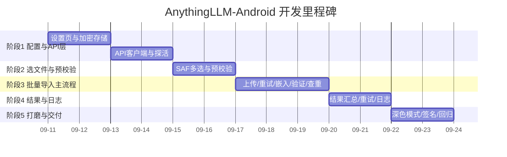

# AnythingLLM 批量导入工具(Android 版)— 开发计划

| 项 | 值 |
|---|---|
| 文档版本 | v1.0(待审阅) |
| 编制日期 | 2026-09-10 |
| 状态 | 待审阅 |
| 总工时预估 | **10–14 人日**(按可并行任务压缩,里程碑见 §2) |
| 执行前提 | 开发文档 v1.0 审阅通过;AnythingLLM 局域网可达(已确认) |

---

## 1. 总体节奏与里程碑

> 上图为示意排期(每个阶段门验收通过才进入下一阶段),实际日期在开工后按阶段门滚动确认。

---

## 2. 阶段划分总览

| 阶段 | 主题 | 核心交付物 | 验收门(通过才进下一阶段) | 预估工时 |
|---|---|---|---|---|
| 0 | 环境搭建 | SDK/Studio/模拟器/项目骨架/首次构建 | ✅ 已完成(APK 可安装运行) | 已完成 |
| 1 | 配置与 API 层 | 设置页、加密存储、AnythingLLM 客户端、探活、工作区列表 | 模拟器内可连通宿主机 AnythingLLM 并列出工作区 | 3.5 人日 |
| 2 | 选文件与预校验 | SAF 多选、白名单/大小/空文件校验、文件名策略 | 选文件后预校验结果正确,中文名转换与 PC 版一致 | 1.5 人日 |
| 3 | 批量导入主流程 | 统一/逐项模式、上传重试、嵌入轮询验证、重复处理 | 全链路批量导入成功,结果与 PC 版一致 | 3 人日 |
| 4 | 结果与日志 | 结果汇总、失败重试、JSONL 日志查看/导出 | 失败项可重试、日志可审计 | 1.5 人日 |
| 5 | 打磨与交付 | 深色模式、Release 签名 APK、真机回归、说明文档 | 可分发 APK,回归清单全过 | 2 人日 |

---

## 3. 各阶段详细任务

### 阶段 1:配置与 API 层(约 3.5 人日)

**前置**:环境已就绪;AnythingLLM 局域网地址确认。

| # | 任务 | 说明 | 对应 FR |
|---|---|---|---|
| 1.1 | 设置页 UI | 服务器地址、API Key 掩码输入、测试连接按钮、高级参数折叠区(超时/白名单/大小/策略/重复动作/聊天测试开关) | FR-01/02 |
| 1.2 | 配置仓库 | DataStore 读写全部配置项 + 默认值回退;EncryptedSharedPreferences 存 API Key | FR-02 |
| 1.3 | API 客户端 | Retrofit 接口实现 §5.2 全部 13 个端点;OkHttp 拦截器加 Bearer;超时映射 | FR-01 |
| 1.4 | 探活与错误分类 | ping→auth→embedder 三级探测;不可达/Key 无效/正常三态;错误消息中文化 | FR-01 |
| 1.5 | 工作区/文件夹列表 | 工作区列表+搜索;文件夹树(一级)列表+创建;默认工作区记忆 | FR-05/06 |
| 1.6 | 单元测试 | 配置解析/回退、错误分类;MockWebServer 验证端点契约 | FR-01/02 |

**验收门**:
1. 模拟器内设置 `http://10.0.2.2:3001` + apikey.txt 的 Key,点"测试连接"显示"连接正常"。
2. 能列出宿主机 AnythingLLM 的全部工作区与 custom-documents 文件夹。
3. 错误场景(停服/错误 Key)呈现正确中文提示。
4. 单元测试通过。

### 阶段 2:选文件与预校验(约 1.5 人日)

| # | 任务 | 说明 | 对应 FR |
|---|---|---|---|
| 2.1 | SAF 多选 | ACTION_OPEN_DOCUMENT 多选;读取名称/大小/类型;持久 URI 权限 | FR-03 |
| 2.2 | 预校验器 | 扩展名白名单、maxFileSizeMB、空文件过滤,输出通过/拒绝清单 | FR-04 |
| 2.3 | 文件名策略 | `ConvertToStorageName` Kotlin 移植(unicode/strip/keep),含边界用例 | FR-09 |
| 2.4 | 校验结果页 | 通过/拒绝分区展示;总数/总大小 | FR-04 |

**验收门**:
1. 多选任意文件,白名单外的扩展名、超 100MB、空文件被正确拒绝并注明原因。
2. 中文文件名转换结果与 PC 版输出逐项一致(用 PC 版测试文件对照)。

### 阶段 3:批量导入主流程(约 3 人日)

| # | 任务 | 说明 | 对应 FR |
|---|---|---|---|
| 3.1 | 目标选择页 | 统一/逐项模式切换;文件夹+工作区选择;逐项模式逐文件选择 | FR-05/06/07 |
| 3.2 | 上传队列 | 协程并发控制(建议 2 并发);multipart 构造(metadata 在前);进度回调;取消支持 | FR-08 |
| 3.3 | 重试 | 上传失败自动重试 2 次,指数退避(2s 起);重试次数用尽标记失败 | FR-08 |
| 3.4 | 嵌入与验证 | update-embeddings 触发;docpath 轮询验证(2s→5s 退避,300s 超时) | FR-11 |
| 3.5 | 重复检测 | 上传前按 title 比对;命中弹对话框(保留/跳过/替换/中止 + 应用到全部) | FR-10 |
| 3.6 | 替换实现 | update-embeddings 解关联为主 + remove-documents 物理删除为辅 | FR-10 |
| 3.7 | 进度页 | 总进度、单文件状态卡片、阶段标签、暂停/取消 | FR-08/11 |

**验收门**:
1. 模拟器端到端:选 3 个文件(含中文名)→ 统一模式 → 上传 → 嵌入 → 验证全部通过;PC 端 AnythingLLM 中可见对应文档且 sourceDocument 显示中文。
2. 重复文件命中时四类动作行为正确;替换后无孤儿文档。
3. 断网场景:上传失败自动重试,最终正确标记失败。

### 阶段 4:结果与日志(约 1.5 人日)

| # | 任务 | 说明 | 对应 FR |
|---|---|---|---|
| 4.1 | 结果汇总页 | 成功/失败/跳过计数;失败列表+原因;单条与全部重试 | FR-12 |
| 4.2 | JSONL 日志 | 追加写 import-YYYYMMDD.jsonl;动作/文件/结果/错误;30 天清理 | FR-13 |
| 4.3 | 日志页 | 倒序列表、导出(SAF 创建文件)、清理 | FR-13 |

**验收门**:
1. 混合结果场景(部分失败)汇总数字与明细一致,重试后状态正确流转。
2. 日志行结构与 PC 版可对照,导出文件可打开。

### 阶段 5:打磨与交付(约 2 人日)

| # | 任务 | 说明 | 对应 FR |
|---|---|---|---|
| 5.1 | 深色模式 | DayNight 主题、双端视觉检查 | FR-15 |
| 5.2 | 服务器状态卡片 | 主页展示连通状态/工作区数 | FR-16 |
| 5.3 | Release 构建 | 签名配置、`assembleRelease`、APK 产出 | — |
| 5.4 | 回归测试 | §4 回归清单全量执行(模拟器 + 真机) | 全部 |
| 5.5 | 交付物 | 安装说明、使用说明、已知限制 | — |

**验收门**:Release APK 可在真机安装运行;回归清单无未决项。

---

## 4. 测试与回归清单

### 4.1 单元测试

- `ConvertToStorageName`:unicode/strip/keep 全策略;纯 ASCII/中文/特殊字符(`"` `\`)/空名/纯标点。
- 预校验:白名单、大小边界、空文件。
- 配置:默认值回退、非法值处理。
- 错误分类:不可达/401/超时/限流映射。

### 4.2 集成测试(MockWebServer)

- 13 个端点请求路径/方法/头/体与 PC 版一致;上传 multipart 结构校验(metadata 在 file 前、filename=storageName)。

### 4.3 端到端回归(手工)

| # | 场景 | 通过标准 |
|---|---|---|
| R1 | 首次启动 → 设置服务器+Key → 测试连接 | 三态提示正确 |
| R2 | 多选文件 → 预校验 | 白名单/大小/空文件正确拒绝 |
| R3 | 中文文件名统一模式导入 | 存储名 uXXXX,sourceDocument 显示中文 |
| R4 | 逐项模式 | 每文件独立目标,结果正确 |
| R5 | 重复导入 | 四类动作生效,替换无孤儿 |
| R6 | 断网/停服 | 自动重试,最终失败标记与提示 |
| R7 | 取消导入 | 队列停止,已上传项可验证 |
| R8 | 结果重试 | 失败项重试后状态正确 |
| R9 | 日志导出 | 文件可打开,内容可审计 |
| R10 | 深色模式 | 双主题无视觉问题 |
| R11 | 真机(局域网 IP) | 与模拟器结果一致 |

---

## 5. 风险与对策

| # | 风险 | 影响 | 对策 |
|---|---|---|---|
| 1 | 明文 HTTP 被 Android 限制 | 局域网 HTTP 无法访问 | manifest 声明 cleartext;支持 HTTPS 时收紧 securityConfig |
| 2 | 大文件上传耗时/进程被杀 | 导入中断 | 前台 Service + 通知;取消可恢复;分片流式读 |
| 3 | AnythingLLM 接口版本差异 | 字段/端点失效 | API 层集中封装;联调时用真实实例校准(本机 3001) |
| 4 | 模拟器 GPU/皮肤兼容 | 显示异常 | 已用裸屏+auto GPU 模式规避;真机兜底 |
| 5 | 中文文件名策略与 PC 版不一致 | 存储名差异 | 用 PC 版输出做对照测试用例 |
| 6 | 手机后台省电策略杀进程 | 导入中断 | 前台 Service + 用户引导 |
| 7 | API Key 泄露 | 安全 | 加密存储;日志脱敏;gitignore 已加 |

---

## 6. 依赖与前置确认(开工前需你拍板)

| 项 | 状态/待确认 |
|---|---|
| 技术方案与文档 | **待你审阅** |
| 默认服务器地址 | 建议 `http://10.0.2.2:3001`(模拟器) / 局域网 IP(真机),是否同意 |
| 明文 HTTP 策略 | 同意局域网 HTTP 场景放行?(后续可加 HTTPS) |
| 并发上传数 | 建议 2(兼顾速度与服务器压力),是否调整 |
| 测试检索(chat) | 默认关闭(askForChatTest=false),是否保留该功能到 P1 |
| 真机回归 | 阶段 5 需要一台真机(或确认仅模拟器交付) |

---

## 7. 完成定义(DoD)

- 全部 P0 功能在模拟器端到端可用,PC 端 AnythingLLM 可验证结果。
- 单元/集成测试通过;回归清单 R1–R11 无未决项。
- Release APK 产出并可在真机安装。
- 使用说明文档随 APK 交付。

> 审阅意见可直接在文档上批注,或口头告知;确认后从阶段 1 开工。
