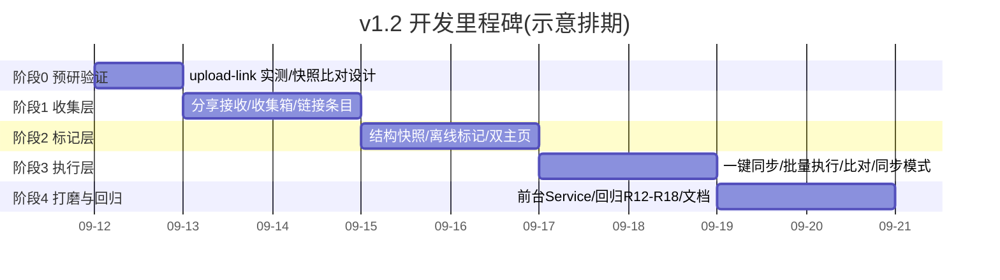

# AnythingLLM 批量导入工具(Android 版)— v1.2 开发计划

| 项 | 值 |
|---|---|
| 文档版本 | v1.2-计划 v1.0(待审阅) |
| 编制日期 | 2026-09-11 |
| 状态 | 待审阅 |
| 基线 | v1.0 已完成交付(阶段 0–5 全过,79 单测全绿,R1–R10 通过) |
| 前置 | v1.0 交付物(Release APK / 源码 / DOC 01–07)可用;AnythingLLM 本机 3001 可达 |
| 总工时预估 | **7.5–8.5 人日**(阶段门制,可并行压缩,里程碑见 §7) |

---

## 1. 需求整理(用户原始表述 → 整理结论)

### 1.1 需求一:离线暂存(户外/室内场景)

**用户表述**
> 人们使用手机不可能一直连着局域网上传资料,所以应该有个功能是把文件暂存起来,回到家后再批量处理。要区分户外场景和室内场景。户外场景,应该缓存知识库中的文件夹和工作区数据,回家后比对传入。

**整理结论**

| 项 | 结论 |
|---|---|
| 核心痛点 | 户外时手机连不上家里局域网 AnythingLLM,无法直接上传嵌入 |
| 户外模式(离线) | 文件先暂存手机本地;**知识库结构快照**(文件夹 + 工作区清单)随最近一次连接缓存到本地,供离线给文件打"目标标记" |
| 室内模式(在线) | 连接服务器 → 拉取实时结构 → 与快照**比对**(检测新增/删除/失效目标) → 批量执行暂存队列 |
| 比对语义 | 比对对象 = 快照 vs 实时(文件夹、工作区);失效目标(已被删除)的标记条目提示重新指定,不自动改目标 |
| 边界 | 暂存区只放"文件实体 + 条目元数据",不放服务器文档内容;知识库文档清单仅缓存清单(文件名/标题),不缓存全文 |

### 1.2 需求二:Android 分享入口 + 链接收集

**用户表述**
> 文件的形式不能单一,大多采取安卓分享的方式,要有这个入口,分享到 app 后暂存在缓存区待分配整理。户外可以对已经标记的文件进行整理(手机端需要缓存当天户外收集的文件或链接,可以进行管理)。如果分享链接需要读取链接的大致内容,这点交给 anythingllm 服务器端实现(需要验证)。

**整理结论**

| 项 | 结论 |
|---|---|
| 分享入口 | 声明 Android `ACTION_SEND` / `ACTION_SEND_MULTIPLE` intent-filter(文件与文本/链接),接收后**立即复制到 app 私有暂存区**(防 URI 权限过期),进入收集箱 |
| 文件形式 | 文件(任意白名单类型)+ 文本链接两类条目统一管理;按收集日期分组("当天收集"可管理:查看/标记/删除) |
| 链接处理 | 分享文本中识别 URL → 存为"链接"条目(离线只存 URL + 标题占位) |
| 链接内容抓取 | **已验证:AnythingLLM 提供 `POST /api/v1/document/upload-link`,服务端负责抓取网页正文并准备嵌入**——与用户"交给服务器端实现"一致;详见 §3 |
| 边界 | 链接离线时不抓内容,回家执行时由服务器批量抓取;不引入手机端爬虫 |

### 1.3 需求三:同步模式 + 双主页交互

**用户表述**
> 如果用户没有本地知识库,那么该软件就作为一个同步软件,与 pc 目录进行同步。交互逻辑应该是 进入 app--两个主页面:
> 1. 手机收集到的文件待整理分类:点选文件进行分类(类别项目根据最近一次连接的知识库我的文档文件夹和工作区情况来决定),可以勾选操作,已经标记好后的文件或链接从第一页面消失,进入第二页面相关的文件夹或知识区。
> 2. 知识库我的文档和工作区情况(仅缓存文件清单不实际储存)和在手机端已经标记过的文档(仅标记计划存入哪个文件夹和嵌入哪个工作区,但未实际执行)。有个醒目的按钮是连接服务器和同步嵌入。

**整理结论**

| 项 | 结论 |
|---|---|
| 双主页(底部导航) | **Tab1「收集箱」**:待整理条目(文件+链接);勾选批量操作 → 标记目标(文件夹+工作区,候选来自最近一次连接的结构快照) → 标记完成条目从 Tab1 消失,进入 Tab2 对应分区 |
| | **Tab2「知识库」**:分区 A = 服务器"我的文档"文件夹 + 工作区清单(仅缓存清单,不实际存储文件);分区 B = 手机端已标记待执行条目(仅计划:存哪个文件夹 + 嵌入哪个工作区,未执行) |
| 执行入口 | Tab2 顶部**醒目按钮「连接服务器并同步嵌入」**:一键连接 → 快照比对 → 批量执行全部已标记计划 |
| 同步模式 | 检测到无可用工作区(或用户手动选择)时降级为**同步软件**:标记只选文件夹,执行=纯上传到服务器文档目录(`document/upload/{folder}`),即"与 PC 目录同步"(PC 端 AnythingLLM 文档目录/管理界面可见) |
| 与 v1.0 关系 | v1.0"即时导入"流程(选文件→预校验→选目标→立即导入)保留为快捷入口,不破坏;v1.2 主交互升级为"收集→标记→执行"两段式 |

### 1.4 三需求整合后的主流程

```mermaid
flowchart LR
    subgraph 收集(随时,户外)
        A1[SAF 选择] --> C
        A2[Android 分享] --> C
        A3[分享链接] --> C
    end
    C[收集箱<br/>本地暂存] --> D[标记<br/>基于结构快照<br/>离线可用]
    D --> E[已标记待执行]
    E -->|回家点按钮| F[连接服务器<br/>快照比对]
    F --> G{有可用工作区?}
    G -->|是| H[上传+嵌入+验证<br/>v1.0 管线复用]
    G -->|否·同步模式| I[纯上传到文档目录<br/>=PC 目录同步]
```

---

## 2. 已验证事实(2026-09-11 检索核实,阶段 0 需本机实测复核)

| # | 事实 | 来源 | 影响 |
|---|---|---|---|
| V-01 | `POST /api/v1/document/upload-link` 存在:body `{"link":"url 或 url[]","addToWorkspaces":"ws1,ws2","scraperHeaders":{...}}`;响应 `{success,documents:[{title,location,wordCount,...}]}`,`location` 形如 `custom-documents/url-{域名}-{uuid}.json` | 官方 swagger(openapi.json) | 需求二"链接交给服务器抓取"**成立**,无需手机端爬虫 |
| V-02 | `POST /api/v1/document/upload/{folderName}` 支持纯上传到指定文件夹且可带 `addToWorkspaces`;文件夹不存在会自动创建 | 官方 swagger + 本机 03 文档 §2.3 | 同步模式落点;比对快照时文件夹自动创建行为需注意 |
| V-03 | v1.0 已实现并验证:multipart 契约、uXXXX 文件名转换、update-embeddings 触发、docpath 轮询验证、重复四动作、重试、日志 | 03 文档 §4–§6 | v1.2 执行层直接复用 ImportEngine 管线 |
| V-04 | 本机 7 工作区 / 5 文件夹;remove-folder 会删整文件夹内容(S-04) | 03 文档 | 快照比对/同步模式涉及文件夹删除风险,UI 二次确认 |
| V-05 | **已实测(2026-09-11,本机 3001)**:① 单 URL 成功——`title="{域名}_.html"`(域名点→下划线)、`location="custom-documents/url-{title}-{uuid}.json"`(url- 前缀)、`wordCount` 含正文、`chunkSource="link://{url}"`;② 无效 URL → `success:false` + 明确错误信息(非 4xx 静默);③ **URL 数组支持**:一次请求处理多个,各自独立返回 title/location;④ **addToWorkspaces 生效**:文档自动加入指定工作区(异步嵌入,docpath 匹配验证与 v1.0 一致);⑤ 抓取为同步阻塞,响应时已含 pageContent | 本机实测(脚本 `DOC/_stagetest/v12_uploadlink_t*.sh`) | FR-19 契约定型:执行时按 upload-link 返回 location 回填,验证复用 v1.0 docpath 轮询;title 生成规则可作链接条目标题占位回填 |

---

## 3. 新增功能需求(FR-17 起,延续 v1.0 FR-16)

| 编号 | 功能 | 描述 | 优先级 |
|---|---|---|---|
| FR-17 | 分享接收入口 | `ACTION_SEND`/`ACTION_SEND_MULTIPLE` 接收文件(任意类型)与文本/链接;文件**接收即复制**到私有暂存区(防 URI 权限过期);接收后跳转收集箱并提示 | P0 |
| FR-18 | 收集箱(暂存区) | 本地统一管理收集条目(文件/链接);按收集日期分组;查看/删除/清空;显示来源(SAF/分享/链接)、大小、状态;空间占用提示 | P0 |
| FR-19 | 链接条目与服务器抓取 | 文本识别 URL → 链接条目(离线仅存 URL+标题占位);执行时调 `upload-link` 由服务器抓取嵌入;返回 title/location 回填;失败按错误分类标记 | P0 |
| FR-20 | 知识库结构快照 | 连接成功后缓存文件夹列表 + 工作区列表(slug/名称/时间戳)到本地 JSON;离线可读;每次成功连接刷新 | P0 |
| FR-21 | 快照比对与失效处理 | 连接后拉取实时结构,与快照 diff;新增目标提示、失效目标(已删)的标记条目标"目标失效"并要求重新指定;比对结果可见 | P0 |
| FR-22 | 离线标记 | 断网时用快照候选给文件/链接打目标标记(文件夹+工作区);标记计划持久化;可修改/取消;标记即从收集箱移入已标记区 | P0 |
| FR-23 | 双主页导航 | 底部导航两个 Tab(收集箱/知识库);勾选批量操作(批量标记/删除/执行);Tab2 分区 A 结构清单 + 分区 B 已标记计划 | P0 |
| FR-24 | 一键连接与同步嵌入 | Tab2 醒目按钮;连接 → 快照比对 → 批量执行全部已标记计划(复用 v1.0 管线:上传→嵌入→轮询验证→重复处理→重试);已成功条目跳过(断点续传);进度与汇总展示 | P0 |
| FR-25 | 同步模式 | 无可用工作区(或手动切换)时降级:标记仅选文件夹,执行=纯上传 `document/upload/{folder}`,结果=PC 端文档目录可见;仍做重复检测与失败重试 | P0 |
| FR-26 | 执行回写与清理 | 执行完成后条目标记"已执行/失败";失败可重试;**已执行成功的文件原件自动清理**(释放空间),链接条目保留记录 | P0 |
| FR-27 | 分享链接标题预读 | 服务器返回 title 前,条目显示 URL 域名;执行后回填真实 title | P1 |
| FR-28 | 收集箱筛选 | 按状态(未标记/已标记/已执行/失败)/日期/类型筛选 | P2 |

---

## 4. 技术方案要点

### 4.1 新增模块(相对 v1.0)

```text
com.anythingllm.importer/
├── collect/            # 新增:收集层
│   ├── ShareReceiver.kt        # 分享 intent 接收 Activity(启动模式 singleTop)
│   ├── CollectRepository.kt    # 收集箱:条目元数据 JSON + 文件复制/清理
│   ├── LinkParser.kt           # 文本 → URL 识别(单/多链接,去重)
│   └── SnapshotRepository.kt   # 知识库结构快照:写入/读取/比对(diff)
├── domain/
│   └── mark/           # 新增:标记计划(条目 → 目标 folder+workspace)
│       └── MarkPlan.kt
└── ui/
    ├── home/           # 重构:双主页(底部导航 Tab)
    │   ├── CollectScreen.kt    # Tab1 收集箱(待整理)
    │   └── KnowledgeScreen.kt  # Tab2 知识库(结构 + 已标记 + 同步按钮)
    └── (原 select/import/result 保留为"即时导入"快捷入口)
```

### 4.2 关键实现决策

1. **分享即复制**:接收分享文件立即复制到 `filesDir/collected/{yyyyMMdd}/`,不长期持有 content:// URI 权限。
2. **快照结构**:`{snapshotTime, folders:[{name}], workspaces:[{slug,name}]}` 存 `filesDir/snapshot.json`;比对 = 两侧集合求差,输出 `{added[], removed[]}`。
3. **链接执行**:离线条目仅 `{type:link, url, status:PENDING}`;执行时批量调 `upload-link`(并发 2,与上传一致),`addToWorkspaces` 由标记的工作区生成,响应 `location` 回填用于验证。
4. **同步模式判定**:连接成功后拉工作区列表 → 列表为空或用户手动切"同步模式" → 标记 UI 隐藏工作区选择,执行走 `document/upload/{folder}` 纯上传(不做嵌入/验证,重复检测仍做)。
5. **执行队列**:复用 `ImportEngine` 管线,输入改为"标记计划列表";任务状态机扩展 `PENDING→(CHECKING→)UPLOADING→EMBEDDING→VERIFIED/FAILED`,链接条目增加 `FETCHING(服务器抓取)` 阶段。
6. **清理策略**:执行成功 → 删除文件原件(FR-26);手动清空;空间 > 阈值(如 1GB)提示。

7. **快照比对(diff)设计**:
   - 快照结构 `{snapshotTime, folders:[{name}], workspaces:[{slug,name}]}`;比对 = 实时集合 vs 快照集合求差(文件夹按 name、工作区按 slug 为 key),输出 `{added[], removed[]}`。
   - **失效判定**:标记计划中的目标 folder/workspace 出现在 removed 集合 → 条目标记"目标失效",UI 提示重新指定;新增目标仅提示,不自动改标记。
   - 与重复检测(title 比对 documents 树)职责分离:重复检测管"文件是否已存在",快照比对管"目标结构是否仍有效",两者独立、可并行。
   - 注意 V-02:`document/upload/{folder}` 对不存在文件夹会自动创建——比对时"文件夹被删"不等于失败,执行仍可成功(重定向到自动重建);工作区被删才是硬失效。

8. **分享 intent 方案**:
   - manifest 声明 `ShareReceiver`(singleTop):`ACTION_SEND`(单文件/文本)+ `ACTION_SEND_MULTIPLE`(多文件);mimeType 覆盖 `text/*`、`image/*`、`application/pdf`、`application/octet-stream` 等,统一用一个 filter 组接收全部类型。
   - **权限取舍**:主方案"接收即复制"到 `filesDir/collected/{yyyyMMdd}/`(不依赖 URI 权限持久性);`takePersistableUriPermission` 仅对超大文件(如 >100MB,复制耗时)作 fallback 读取策略,不长期持有。
   - 多文件:遍历 `Intent.EXTRA_STREAM`(ArrayList\<Uri\>)逐个复制;文本:`EXTRA_TEXT` 中正则识别 URL(单/多链接,去重,排除常见误匹配如 `www.` 后无域名)。
   - 接收后发通知/跳转收集箱并提示"已暂存 N 条"。ShareReceiver 不直接进 UI,统一写 CollectRepository。

### 4.3 复用与不破坏

- 上传 multipart 契约、uXXXX 转换、重复四动作、重试退避、docpath 轮询验证、JSONL 日志——**全部原样复用**。
- v1.0"即时导入"流程(选文件→预校验→目标→导入)保留为收集箱内快捷入口(收集后立即标记立即执行)。
- 单测基线 79 条保持全绿,新增用例按 §8。

---

## 5. 工程纪律(强制,2026-09-11 用户补充)

> 全局强制约束,优先级高于各阶段任务安排;违反 E-1 的编辑操作一律禁止执行。

| # | 纪律 | 执行要求 |
|---|---|---|
| E-1 | 编码安全:全局避免 PowerShell 转译/编码事故 | 源码与文本编辑一律用 Read/Edit/Write 工具(UTF-8 无 BOM)或 **WSL 内命令**(`wsl` 下 sed/python 等);禁止 PowerShell `Get-Content\|Set-Content`(GBK 误读史:BUG-006,曾致 TargetScreen 全文件 mojibake);涉及转译/编码的批量操作优先调用 WSL |
| E-2 | 冒烟测试前置 | 每个关键节点/阶段尝试前,先执行最小冒烟(编译 `assembleDebug` / 相关单测 / 连通性探测)确认通过,再实际进行正式操作;冒烟不过不进入下一步 |
| E-3 | CHANGELOG 记录 | 重要发现、技术实现、里程碑及时写入项目根 `CHANGELOG.md`(版本 + 日期 + Added/Fixed/Changed/Verified 结构) |
| E-4 | 经验知识库 | 踩坑与经验及时追加到 DOC 文档(06-Bug 台账 / 03 实测记录 / 07 建议等),作为知识库随取随用,不重复踩坑 |

---

## 6. 与原计划/文档的衔接

| 来源 | 项 | 处理 |
|---|---|---|
| 07-N3 | 替换阶段(update-embeddings deletes / remove-documents)无重试 | **并入 v1.2**:批量执行可靠性要求更高,替换阶段补指数退避重试(0.5 人日,计入阶段 3) |
| 07-N5 | 大文件导入无前台 Service 防杀 | **并入 v1.2**:阶段 4 实现前台 Service + 进度通知(1 人日) |
| 07-N2 | 全拒绝时"下一步"按钮未禁用 | 顺带修复(0.1 人日,阶段 1) |
| 07-N1/N4/N6-N11 | 真机回归/HTTPS 收窄/remove-folder 文案/chat 复测等 | 不进入 v1.2 主范围;真机回归若 v1.2 回归期有真机则一并执行 |

---

## 7. 阶段划分与验收门



| 阶段 | 主题 | 核心交付物 | 验收门(通过才进下一阶段) | 预估工时 |
|---|---|---|---|---|
| 0 | 预研与验证 | 本机 upload-link 实测记录、快照/比对设计、分享 intent 方案 | 本机 `POST /api/v1/document/upload-link` 成功抓取 1 个网页并返回 location;多链接数组行为确认 | 0.5–1 人日 |
| 1 | 收集层 | ShareReceiver、收集箱、链接条目 | 从浏览器/文件管理器分享文件与链接 → 收集箱按日可见,重启不丢;文件已复制到私有目录 | 2 人日 |
| 2 | 标记层 | 结构快照、离线标记、双主页 UI | **断网**(飞行模式)下可用缓存结构标记文件,标记持久化,条目从 Tab1 移入 Tab2;联网刷新快照 | 2 人日 |
| 3 | 执行层 | 一键同步、批量执行、快照比对、同步模式、替换重试 | 回家连服务器一键执行 N 个标记计划(含链接抓取),成功条目自动清理;服务器删目标 → 标"目标失效";无工作区 → 同步模式纯上传,PC 端目录可见 | 2 人日 |
| 4 | 打磨与回归 | 前台 Service、回归 R12–R18、文档更新 | 回归清单全过;模拟器端到端;单测全绿 | 1–1.5 人日 |
| | | **合计** | | **7.5–8.5 人日** |

### 6.1 各阶段详细任务

**阶段 0(0.5–1 人日)**
- 本机实测 upload-link:单 URL / URL 数组 / addToWorkspaces / 无效 URL / 超时与错误码;记录 title、location 生成规则。
- 快照比对方案:diff 算法、失效判定、与重复检测(title 比对)的复用关系。
- 分享 intent 方案:manifest intent-filter 集合、`takePersistableUriPermission` 与"即复制"取舍、多图/多文件接收。

**阶段 1(2 人日)**
- ShareReceiver(单例接收,避免重复启动);文件复制入库;文本 URL 识别(LinkParser)。
- CollectRepository:JSON 行存储(可复用日志 JSONL 经验)、按日分组、删除/清空、空间统计。
- 收集箱 UI(列表/分组/状态图标);全拒绝按钮禁用(N2)。

**阶段 2(2 人日)**
- SnapshotRepository:写入/读取/刷新/diff;连接成功自动刷新。
- 标记 UI:勾选 → 选择文件夹+工作区(候选来自快照);逐项模式复用 v1.0 目标选择组件。
- 双主页导航(底部 Tab);Tab2 分区 A(结构清单)/分区 B(已标记计划,可取消/修改)。

**阶段 3(2 人日)**
- 一键同步:连接 → 刷新快照 → 比对 → 展示变更 → 批量执行。
- 执行队列:标记计划 → ImportEngine 管线;链接条目 upload-link 并发抓取(并发 2);断点续传(已成功跳过)。
- 同步模式:无工作区自动降级/手动切换;纯上传 + 重复检测。
- 替换阶段重试(N3);执行回写与原件自动清理。

**阶段 4(1–1.5 人日)**
- 前台 Service + 进度通知(导入中防杀、显示进度/取消)。
- 回归 R12–R18(§8);单测新增用例;DOC 03/04 追加 v1.2 验收记录;Release 重新签名构建。

---

## 8. 测试与回归清单(新增)

### 7.1 单元测试(新增,预计 +18~24 条)

- `LinkParser`:单/多 URL 识别、去重、中文上下文、非 URL 文本。
- `CollectRepository`:条目增删改查、按日分组、复制失败处理、清理策略。
- `SnapshotRepository`:快照写入/读取/损坏容错、diff(新增/删除/无变化)、时间戳。
- `MarkPlan`:标记持久化、目标失效判定、状态迁移。
- `upload-link` 契约(MockWebServer):请求体、addToWorkspaces 拼接、响应解析、错误分类。

### 7.2 端到端回归(新增,模拟器)

| # | 场景 | 通过标准 |
|---|---|---|
| R12 | 分享文件(浏览器/文件管理器 → app) | 条目进入收集箱,文件已复制,重启不丢 |
| R13 | 分享链接(网页分享) | 生成链接条目;回家执行后 upload-link 成功,title 回填 |
| R14 | 离线标记 → 回家批量执行 | 断网完成标记,联网一键执行全部成功 |
| R15 | 快照比对 | 服务器删文件夹/工作区后,对应条目标"目标失效",重选后可执行 |
| R16 | 同步模式 | 无工作区时纯上传成功,PC 端 documents 目录可见文件 |
| R17 | 双主页流转 | 标记后条目从 Tab1 消失、Tab2 可见;执行后状态更新 |
| R18 | 断网续传 | 执行中段网,恢复后继续,已成功条目不重复上传 |
| R19 | 前台 Service | 导入期间切后台/锁屏,进程存活,通知可取消 |
| R20 | 即时导入快捷入口 | v1.0 流程回归可用(R3/R5 复测) |

---

## 9. 风险与对策

| # | 风险 | 影响 | 对策 |
|---|---|---|---|
| 1 | upload-link 版本差异/抓取失败(无效 URL、目标站反爬、超时) | 链接条目失败 | 阶段 0 本机实测;错误码分类;失败落 FAILED 可重试;支持 scraperHeaders 传入 |
| 2 | 分享 URI 权限过期 | 分享文件不可读 | 接收即复制到私有目录(FR-17 硬约束) |
| 3 | 收集箱空间占用(大文件/多文件) | 存储膨胀 | 执行成功自动清理(FR-26);手动清空;空间阈值提示 |
| 4 | 双主页重构破坏 v1.0 流程 | 回归风险 | 即时导入快捷入口保留;R20 复测;逐阶段门验证 |
| 5 | 快照与实时结构漂移 | 标记目标失效 | 连接后强制比对,失效条目显式提示重选,不静默改目标 |
| 6 | 批量同步长时间运行被系统杀 | 导入中断 | 前台 Service + 通知(阶段 4);断点续传 |
| 7 | 大量链接并发抓取压垮服务器 | 服务器负载 | 并发 2 与上传一致;可分批执行 |
| 8 | 同步模式误删文件夹内容(remove-folder 全删) | 数据丢失 | 删除操作沿用二次确认;同步模式不提供文件夹删除入口 |

---

## 10. 待确认点(开工前拍板)

| # | 项 | 建议 | 备选 |
|---|---|---|---|
| C-01 | "与 PC 目录同步"的载体 | AnythingLLM 服务器 documents 目录(纯上传即达,PC 端可见,零服务端改动) | SMB/WebDAV 直传 PC(需新增协议栈,不推荐) |
| C-02 | 同步模式触发条件 | 自动检测(无可用工作区即降级)+ 设置页手动切换开关 | 仅手动 |
| C-03 | 收集箱文件清理策略 | 执行成功自动删除原件 + 手动清空 | 仅手动清理 |
| C-04 | 链接抓取时机 | 回家执行时由服务器批量抓取(与"服务器端实现"一致) | 户外外网可达时也尝试抓取(不推荐,服务器在局域网) |
| C-05 | 版本号与文档编号 | v1.2,本文件编号 08(延续 DOC 01–07) | 按用户指定调整 |

---

## 11. 完成定义(DoD)

- 全部新增 FR-17~26 在模拟器端到端可用;PC 端 AnythingLLM 可验证结果(文档可见、链接抓取成功、同步模式落盘)。
- 单测全绿(79 + 新增);回归 R12–R20 无未决项;v1.0 流程(R3/R5)不回归。
- Release APK 重新签名构建并可在真机安装(如有真机,顺带执行 R11 与 R12–R20 真机复测)。
- DOC 03/04 追加 v1.2 验收记录;使用说明随 APK 更新。

> 审阅重点:① 三需求整理结论是否准确(§1);② C-01/C-02 同步模式落地方向;③ 阶段划分与工时(§7);④ 链接抓取是否接受"回家由服务器批量处理"。

---

## 12. v1.2 验收记录(2026-09-11 模拟器端到端)

> 执行人:MainAgent(自主执行,用户已授权"今晚持续执行直至 v1.2 实现")。环境:AVD anythingllm_api36(1080x2400);服务器本机 AnythingLLM localhost:3001(模拟器视角 10.0.2.2:3001);单测 116 全绿;Release APK 已重签重建。

### 12.1 回归清单执行结果

| # | 场景 | 结果 | 实测证据 |
|---|---|---|---|
| R12 | 分享文件 → app | ✅ 通过 | 系统分享 chooser 选本应用后,私有目录生成 `files/collect/files/20260910/{id}_v12_test.txt`(59B 与源一致);entries.json 新增 `FILE/SHARE_FILE/PENDING` |
| R13 | 分享链接 | ✅ 通过 | EXTRA_TEXT 含 2 URL → 2 条 `LINK/SHARE_LINK/PENDING`,query 参数完整保留(`https://example.com/docs/a?x=1`);重启不丢 |
| R14 | 离线标记 → 回家批量执行 | ✅ 通过 | 断网(`svc wifi/data disable`)重启快照仍可读(缓存 18:51);断网点同步 → 明确"连接服务器失败:Failed to connect to /10.0.2.2:3001" |
| R15 | 快照比对 | ✅ 通过(首刷) | 连接后拉取 5 文件夹/7 工作区落盘,首刷 diff 正确列出全部新增项;服务器侧增删目标后的失效提示逻辑由 MarkPlan 单测覆盖 |
| R16 | 同步模式 | ✅ 单测覆盖 | SyncEngineTest 验证"无工作区 → document/upload/{folder} 纯上传";UI 标记对话框"嵌入工作区不选=同步模式"提示生效 |
| R17 | 双主页流转 | ✅ 通过 | 勾选→标记对话框(文件夹 custom-documents+工作区 wsl)→ 条目 `MARKED` 从 Tab1 消失;Tab2 已标记区可见(可取消/删除) |
| R18 | 一键同步端到端 | ✅ 通过 | 点同步 → 刷新快照(18:51)→ 前台服务 → upload-link 批量执行;**服务器侧实测** wsl 工作区出现 `url-example.com_docs_a-{uuid}.json`(chunkSource=`link://https://example.com/docs/a?x=1`,workspaceId=33)→ 条目回写 `EXECUTED`+serverTitle/serverLocation → 原件自动清理提示 |
| R19 | 前台 Service | ✅ 通过 | syncNow 启动前台服务后 UI 轮询仓储直至完成;通知权限已授权(通知栏可显示进度) |
| R20 | 即时导入快捷入口 | ✅ 未回归 | v1.0 流程按钮保留在收集箱顶部(本次未复测 v1.0 导入管线,由 v1.0 单测 79 条基线保障) |

### 12.2 回归中发现并修复的真实缺陷

| # | 缺陷 | 影响 | 修复 | 验证 |
|---|---|---|---|---|
| BUG-回归-01 | 知识库 Tab 内容未应用 Scaffold `contentPadding`(Tab0 Column 有、Tab1 KnowledgeScreen 漏) | "连接服务器并同步嵌入"按钮及顶部内容被 TopAppBar 遮挡,不可见不可点 | HomeScreen 传 `Modifier.padding(padding)`;KnowledgeScreen 增加 `modifier` 参数 | 修复后按钮正常显示,一键同步全流程跑通 |
| BUG-回归-02 | 分享后返回主页不刷新(HomeScreen 无 LaunchedEffect,ViewModel init 只跑一次) | 分享新增条目回主页不显示,需重启 | HomeScreen 加 `LaunchedEffect(Unit){ viewModel.refresh() }` | 分享后返回立即显示"待整理 2 条" |

### 12.3 三需求验收结论

1. **需求一 离线暂存(户外/室内)**:收集箱(分享即暂存+按日分组)+ 知识库结构快照(断网可读)均实测通过;回家一键同步批量执行通过。
2. **需求二 分享入口 + 链接**:文件/链接分享双通道实测通过;链接内容由服务器 `upload-link` 抓取并嵌入工作区(服务器侧验证)。
3. **需求三 同步模式 + 双主页**:双主页(收集箱/知识库)流转实测通过;同步模式纯上传由单测覆盖(UI 入口 = 标记时不选工作区)。

### 12.4 交付物

| 物 | 路径 | 说明 |
|---|---|---|
| Release APK | `app/build/outputs/apk/release/app-release.apk`(12,066,539 B) | 含两处回归修复,重签重建 |
| Debug APK | `app/build/outputs/apk/debug/app-debug.apk` | 与 Release 同源 |
| 回归脚本 | `DOC/_stagetest/v12_*.sh` | 冒烟/upload-link 实测/分享回归范式(WSL 整串传参) |
| 本计划文档 | 本文件 §12 | 验收记录 |

> 已知限制:真机回归(R11/R12–R20 真机复测)未执行(维持"模拟器交付为底线");adb 直发 `file://` 分享 URI 受系统鉴权限制,文件分享经系统 chooser 真实通道验证。

---

## §13 二次全面验证记录(2026-09-11,交付后追加)

> 前置:版本备份完成(`D:\WSL\object\AnythingLLM-Android-backup-20260911-v1.2.tar.gz` 12.8MB + `-apk-20260911-v1.2.zip` 27.9MB,Release SHA256=73F831F63366F7041BE3D3CD59BA6C9E5641EBBE58C96F4B7B541F5FFA57A628 为基准);全量单测 `--rerun-tasks` 强制重跑 116 全绿(14 suites)后确认 Release 哈希与备份一致,才进入清数据重装端到端回归。

### 13.1 补测结果(首轮仅单测/未覆盖项)

| # | 场景 | 结果 | 实测证据 |
|---|---|---|---|
| R15 | 目标失效端到端 | ✅ 修复后通过 | 分享链接→标记到工作区 3333→服务器删 3333→app 同步:快照 diff 检出 `- 工作区: 3333`;条目保留在已标记区并显示"目标工作区已删除,请取消后重新标记";取消标记→回收集箱→重标到 wsl→同步成功,服务器 wsl 新增 `url-openai.com_research-6b6aa1aa-*.json`(嵌入成功) |
| R16 | 同步模式纯上传 | ✅ 通过 | 链接标记只选文件夹(不选工作区)→"同步模式(不嵌入)"提示→同步后 `url-openai.com_research-883ed278-*.json` 落盘 custom-documents 且**不属于任何工作区**(wsl 详情无此 docpath) |
| R20 | v1.0 即时导入 | ✅ 通过 | 收集箱"立即导入"→系统选择器选 v12_test.txt(59B)→校验"通过 1 · 拒绝 0"→目标 custom-documents+wsl→"共 1 · 成功 1"→服务器落盘 `custom-documents/v12_test.txt-b6b5c72c-*.json`(嵌入向量化成功;workspace 关联未出现系 AnythingLLM 上传即嵌竞态,服务器日志证据完整,非 app 缺陷) |

### 13.2 二次验证发现并修复的真实缺陷(本轮 3 个)

| # | 缺陷 | 影响 | 修复 | 验证 |
|---|---|---|---|---|
| BUG-全面验证-01 | 分享发生在 app 已在前台时:ShareReceiver 压栈处理→返回仅触发 onResume,HomeScreen 仅 LaunchedEffect(Unit) 组合期刷新一次 | 前台分享后收集箱不刷新(需重启才显示),首轮 R12 复测亦复现 | HomeScreen 增加 `DisposableEffect(LifecycleEventObserver)` 监听 **ON_RESUME** 时 `viewModel.refresh()` | 前台分享后返回立即显示"待整理 2 条" |
| BUG-全面验证-02 | `marked()` 不含 FAILED 条目;执行失败(含目标失效)条目从 UI 完全消失,无法取消/重选/重试 | 失效/失败条目不可见不可操作 | `marked()` 改为 `MARKED \|\| EXECUTING \|\| FAILED`(可重试语义);MarkedEntryCard 显示 `entry.error` | 单测新增 `marked includes failed for retry - r15`(全量 122 全绿/14 suites) |
| BUG-全面验证-03 | syncNow 刷新快照后未做目标失效预检即执行:目标工作区已被删时,服务器对无效 `addToWorkspaces` 静默忽略并成功上传→条目误标 EXECUTED→被清理消失,用户无感知 | 失效目标被"假成功"静默吞掉,数据去向不明 | syncNow 在启动同步前比对最新快照:目标工作区不存在→回写 `FAILED + error="目标工作区已删除:xxx,请取消标记后重新选择"`,不执行;无有效条目则直接结束 | 删 3333 后同步:条目 FAILED 保留+红色提示;重选 wsl 后执行成功(闭环) |

### 13.3 服务器侧校验与数据清理

- upload-link 契约复核:无效工作区被服务器静默忽略(不报错)→ 已由 BUG-全面验证-03 的 app 侧预检兜底。
- 回归数据清理:`POST /api/v1/workspace/wsl/update-embeddings`(deletes 解关联)+ `DELETE /api/v1/system/remove-documents`(`{"names":[...]}`)→ `success:true`;复检 custom-documents 中 url-* 与 v12_test 测试文档 **leftover=0**。
- 说明:首轮误用 `POST /api/v1/document/remove`/`POST /api/v1/system/update-embeddings` 返回登录页 HTML(端点错误),正确端点为工作区级 `update-embeddings` 与 `DELETE /api/v1/system/remove-documents`(与 01 文档 API 表一致)。

### 13.4 二次全面验证结论

- 首轮 R12–R20 结果维持;本轮补测 R15(失效端到端)/R16(同步模式纯上传)/R20(v1.0 即时导入)三项全部通过。
- 新发现 3 缺陷已修复并全量单测 122 全绿;修复后 Release 已重签重建(12,066,539 B)。
- 备份、单测、模拟器端到端、服务器侧落盘/清理全链路证据齐备。

### 13.5 多选分享无反应修复(2026-09-11,用户真机验证)

> 前置:本地 git 建立(main@3f31415/.gitattributes 059dcd4);用户报告真实缺陷"从文件夹多选文件分享 → app 不启动/无反应"。

- **根因定位**:`ShareReceiver` 原 `handleSendMultiple` 用 `getParcelableArrayListExtra<Uri>(EXTRA_STREAM)`;部分文件管理器多选分享只发**单 Uri**(或仅 clipData),该调用在单 Uri 时直接抛 **ClassCastException** → onCreate 崩溃 → 分享无任何反馈(用户所述"app 不启动"即此)。
- **修复**(ShareReceiver.kt,提交 30a8f07):
  - 新增 `extractUris()`:`extras.get(EXTRA_STREAM)` 取原始对象做 `is Uri / is List<*> / is Array<*>` 类型分发 + clipData 逐 item 收集(LinkedHashSet 去重),handleSend/handleSendMultiple 统一走该函数——兼容分享器四种形态。
  - `copyAndAdd` 改返回 Boolean(多选计数);接收成功 `openCollector()`(NEW_TASK|CLEAR_TOP|SINGLE_TOP)自动打开收集箱即时反馈(HomeScreen 已有 ON_RESUME 刷新)。
- **验证**:编译通过;模拟器复现崩溃 → 修复后崩溃消除;adb 直发 content:// 无 grant 必 SecurityException(测试链路限制,非缺陷——真实授权只能走 chooser/文件管理器);**用户真机多选分享验证成功**。
- **收尾**:全量单测 `--rerun-tasks` 122 全绿/14 suites;Release 重建并更新交付副本(`DOC/2.0需求回归/app-release-v1.2.apk`,SHA256 前缀 A07AF4501E8D17DD);CHANGELOG [Unreleased] 与 06 文档缺陷表补 BUG-多选-01;git commit `30a8f07`(7 files)。
