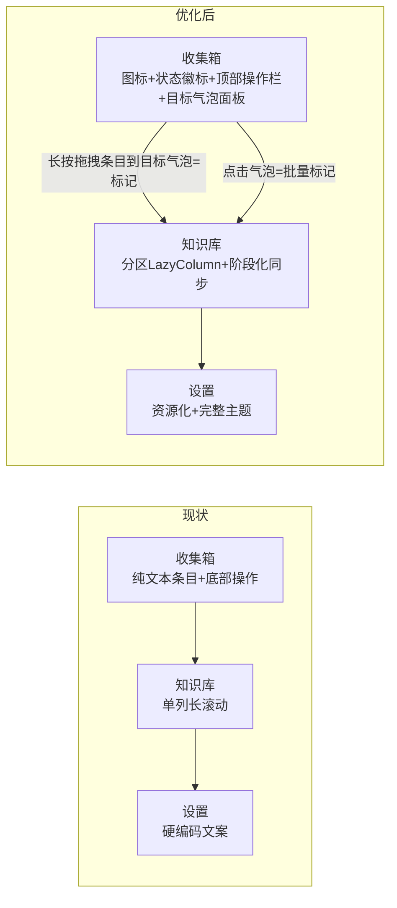

# AnythingLLM 批量导入工具(Android 版)— UI 优化方案

| 项 | 值 |
|---|---|
| 文档版本 | v1.1(待审阅;v1.1 新增 §4.4 气泡拖拽交互) |
| 编制日期 | 2026-09-11 |
| 状态 | 待审阅 |
| 基线 | v1.2 已交付(122 单测全绿,R12–R20 通过,Release APK 可安装) |
| 适用范围 | `app/src/main/java/com/anythingllm/importer/ui/**` + `res/**`(仅 UI 层,不动领域/数据层) |
| 预估工时 | **6.5–8 人日**(阶段门制,含 §4.4 创新交互,详见 §6) |

---

## 1. 现状评估

### 1.1 技术基线(已核实)

| 项 | 现状 |
|---|---|
| UI 框架 | Jetpack Compose + Material 3(BOM 2024.12.01),无 XML 布局 |
| 主题 | `ui/theme/Theme.kt` 仅覆盖 primary/secondary/tertiary 3 个色值;支持 SYSTEM/LIGHT/DARK 三模式(设置页切换) |
| 页面 | Home(底部双 Tab:收集箱/知识库)+ Settings + Select + Validation + Target + Import + Logs,共 7 个 Screen,Navigation Compose 导航 |
| 资源 | `res/` 仅 2 个文件:`strings.xml`(仅 app_name)、`themes.xml`(基础主题+透明分享主题);**无 drawable、无图标资源** |
| 文案 | 全部 UI 文案硬编码在 Compose 代码中,未资源化 |
| 单测 | 122 全绿/14 suites(UI 无预览测试) |

### 1.2 页面清单与职责

| 页面 | 路径 | 核心元素 |
|---|---|---|
| 主页(Tab1 收集箱) | `ui/home/CollectScreen.kt` | 待整理条目按日分组、勾选批量标记/删除、标记对话框 |
| 主页(Tab2 知识库) | `ui/home/KnowledgeScreen.kt` | 同步按钮、进度卡、比对结果、结构快照、已标记计划、设置/日志入口 |
| 服务器设置 | `ui/settings/SettingsScreen.kt` | 地址/Key、测试连接、高级参数折叠面板、主题模式 |
| 选择文件 | `ui/select/SelectScreen.kt` | SAF 多选、已选列表 |
| 预校验结果 | `ui/validate/ValidationScreen.kt` | 通过/拒绝分区列表 |
| 导入目标 | `ui/import/TargetScreen.kt` | 统一/逐项模式、文件夹+工作区下拉 |
| 导入进度 | `ui/import/ImportScreen.kt` | 总进度条、逐文件卡片、重复对话框、暂停/取消 |
| 日志 | `ui/logs/LogsScreen.kt` | 日志文件列表、明细、导出/清理 |

### 1.3 功能完整性结论

**功能层面已完成度高,UI 层存在三类问题**:① 深色模式等正确性缺陷;② 设计系统缺失导致观感"能用但不像成品";③ 知识库 Tab 等信息架构在高信息量场景下不可持续。以下诊断均基于源码证据,非主观审美。

---

## 2. 问题诊断(按优先级聚类)

### 2.1 P0 — 正确性 / 规范缺陷(必须先修)

| # | 问题 | 位置(证据) | 影响 |
|---|---|---|---|
| UI-01 | **深色模式状态栏/启动背景缺陷**:`themes.xml` 固定 `parent="android:Theme.Material.Light.NoActionBar"` + `windowLightStatusBar=true` + `windowBackground=white`,与 Compose 内深色内容无关 | `res/values/themes.xml` | 深色模式下:启动闪白屏;状态栏区域透明+深色图标叠加深色内容 → **状态栏图标不可见** |
| UI-02 | **标记对话框内容溢出**:文件夹/工作区候选用 `forEach` + `RadioButton` 平铺在 `AlertDialog.text` 内,无滚动容器 | `ui/home/CollectScreen.kt` `MarkDialog` | 快照含 10+ 文件夹/工作区时对话框超高,底部"标记/取消"按钮被推出屏幕,内容不可达 |
| UI-03 | **长 URL 溢出卡片**:`detailLine()` 直接拼接 `entry.url.orEmpty()`,无 `maxLines`/`ellipsis` | `ui/home/CollectScreen.kt` `detailLine` | 分享的长链接会把卡片撑破/溢出 |
| UI-04 | **返回按钮不符合 M3 规范**:各页 `navigationIcon` 用 `TextButton("返回")`,非标准返回箭头,热区小、视觉权重错误 | Settings/Select/Validation/Target/Import/Logs 全部 TopAppBar | 可点区域小(约 40×40dp 内仅文字),误触/难触;与 Android 平台惯例不一致 |
| UI-05 | **重复文档对话框按钮布局混乱**:`dismissButton` 内塞 4 个 TextButton(保留/跳过/中止),`confirmButton` 放"替换",底部按钮挤作一团 | `ui/import/ImportScreen.kt` `DuplicateDialog` | 4 个动作无主次、间距过窄,误触风险高 |
| UI-06 | **浅色手动模式(LIGHT)未回归验证** | DOC 07-N7(已知缺口) | 手动浅色模式下未截图确认,存在回归隐患 |

### 2.2 P1 — 设计系统缺失(决定"成品感")

| # | 问题 | 位置(证据) | 影响 |
|---|---|---|---|
| UI-07 | 主题色体系不完整:仅覆盖 3 个色值,`primaryContainer`/`surfaceContainer` 等派生色仍是 M3 默认紫色系,与蓝色 `primary` 混搭 | `ui/theme/Theme.kt` | 全 app 容器色/强调色不协调,深色模式尤为明显 |
| UI-08 | Typography 未定制,全用 M3 默认(西文优先,中文渲染密度不可控) | `ui/theme/Theme.kt` | 标题/正文层级弱,长文件名折行观感粗糙 |
| UI-09 | Shape/圆角未定制,卡片、按钮、对话框全默认 12dp | `ui/theme/Theme.kt` | 层级感弱,无法通过圆角区分卡片/浮层 |
| UI-10 | 间距无规范,16/12/8/6/4dp 混用 | 各 Screen `Modifier.padding` | 页面节奏不统一 |
| UI-11 | **状态符号用纯文本**:`"○✓✗→…"`、`"✓ "` 直接作为状态指示 | `ui/home/KnowledgeScreen.kt` `statusIcon`;`ui/validate/ValidationScreen.kt` `PassedCard`;`ui/import/ImportScreen.kt` | 观感粗糙;无 contentDescription,无障碍读屏混乱;不同字号下符号错位 |
| UI-12 | **无图标资源**:文件/链接/文件夹/工作区/状态无类型图标,`res/` 无 drawable | 全 app | 列表条目可辨识度低,信息密度全靠文字 |
| UI-13 | **文案全部硬编码**:`strings.xml` 仅 app_name | 全 app | 无法 i18n;维护时逐文件改 |
| UI-14 | 无品牌识别:TopAppBar 仅纯文本标题,无图标/品牌元素 | `ui/navigation/AppNav.kt` 各 Screen | 与系统工具无区分 |

### 2.3 P2 — 信息架构 / 页面级重构(决定"好用")

| # | 问题 | 位置(证据) | 影响 |
|---|---|---|---|
| UI-15 | **知识库 Tab 是单列长滚动**:同步按钮+进度卡+比对结果+结构快照+已标记计划+设置/日志按钮全部塞进一个 `verticalScroll` Column;条目多时无虚拟化 | `ui/home/KnowledgeScreen.kt` | 信息密度过高、无分区导航;`markedEntries` 多时全量组合,滚动卡顿;用户找目标要滚很久 |
| UI-16 | **收集箱条目信息层级弱**:文件/链接仅靠一行小字"文件 · SAF · 1.2MB"区分,无类型图标、无状态徽标 | `ui/home/CollectScreen.kt` `EntryRow` | 扫读效率低 |
| UI-17 | 多选操作栏在页面底部(标记/删除按钮),与拇指操作区冲突,且选中时无顶部操作栏反馈 | `ui/home/CollectScreen.kt` | 单手操作不便;选中状态反馈弱 |
| UI-18 | **空状态只有一句话文字**,无引导动作 | `CollectScreen`/`KnowledgeScreen`/`SelectScreen` | 首次使用用户不知道"从分享开始" |
| UI-19 | **无首启引导(onboarding)**:双主页+收集→标记→同步心智模型未被解释 | 全 app | 新用户学习成本高(用户真实需求是"进入 app--两个主页面"的既定心智,需要 UI 显式承载) |
| UI-20 | 服务器连接状态在 v1.2 被弱化:主页不再显示在线/离线(FR-16 的服务器状态卡在 v1.2 重构后消失) | `ui/home/*` | 离线场景用户无法一眼确认当前处于户外(断网)状态 |
| UI-21 | 同步按钮语义单一:加载时只显示转圈,无法区分"连接中/比对中/同步中";完成后无成功态样式与重试入口 | `ui/home/KnowledgeScreen.kt` | 长任务过程无阶段反馈 |
| UI-22 | 比对(diff)结果用纯文本行(`+ 文件夹`/`- 工作区`),无视觉分层 | `ui/home/KnowledgeScreen.kt` | 结构变化不可扫读 |
| UI-28 | **标记交互路径单一**:勾选 → 按钮 → 对话框(RadioButton 列表),无快捷路径;与"收集→标记→同步"高频操作不匹配 | `ui/home/CollectScreen.kt` `MarkDialog` | 一次标记多文件时步骤多、点按路径长;交互未体现"内容投递到目标"的自然心智 |

### 2.4 P3 — 体验打磨(决定"细节")

| # | 问题 | 位置 | 影响 |
|---|---|---|---|
| UI-23 | 页面切换无过渡动画(NavHost 默认无动画) | `ui/navigation/AppNav.kt` | 跳转生硬 |
| UI-24 | 反馈不统一:错误/成功提示散落为页面内 `Text`,无 Snackbar 通道 | 各 Screen | 操作结果反馈弱(如删除、标记、导出完成) |
| UI-25 | 无障碍缺口:状态文本符号、图标无 `contentDescription`;RadioButton 行点击区仅单选钮本体 | `CollectScreen`/`KnowledgeScreen` 等 | TalkBack 读出乱码符号 |
| UI-26 | 部分固定高度(如同步按钮 52dp、进度条行)在大字体/系统缩放下可能裁切 | `KnowledgeScreen` 等 | 无障碍大字模式适配风险 |
| UI-27 | 收集箱空状态/列表头部计算 `sumOf { it.second.size }` 每次重组重算 | `ui/home/CollectScreen.kt` | 可接受,但可 memo 化 |

---

## 3. 设计目标与原则

**产品定位**:局域网工具型效率应用——用户的使用心智是"户外收集 → 室内一键同步",UI 必须让这个两段式流程在**断网**(户外)与**联网**(室内)两种状态下都清晰可用。

| 原则 | 落地含义 |
|---|---|
| 两段式心智优先 | 主界面围绕"收集箱(未完成)→ 知识库(已计划/已执行)"组织,状态流转可见 |
| 信息密度服务于效率 | 列表条目一屏可扫读:图标→标题→状态→元信息,四级信息各有视觉载体 |
| 深色与浅色同等质量 | 以深色模式为主要验收场景(户外夜间使用真实存在),P0 修复先行 |
| 最小侵入 | 仅改 UI 层;不碰领域/数据层;122 单测保持全绿;v1.0 即时导入流程不回归 |

---

## 4. 优化方案明细

### 4.0 P0 — 正确性修复(0.5–1 人日)

| # | 优化内容 | 实施要点 | 涉及文件 |
|---|---|---|---|
| UI-01 | 深色模式窗口层修复 | 新增 `res/values-night/themes.xml`(`Theme.Material.NoActionBar` + 深色 windowBackground + `windowLightStatusBar=false`);values 与 values-night 双份主题;验证:深色下启动无闪白、状态栏图标可见 | `res/values/themes.xml` 新增 `values-night/` |
| UI-02 | 标记对话框改为可滚动 | `MarkDialog` 的候选项区改为 `LazyColumn(Modifier.heightIn(max = 320.dp))`;文件夹/工作区各一个可折叠区块;或用 `ExposedDropdownMenu` 单选替代 RadioButton 平铺 | `ui/home/CollectScreen.kt` |
| UI-03 | 链接元信息防溢出 | `detailLine` 的 URL 部分 `maxLines = 1` + `TextOverflow.Ellipsis`;或将 URL 移入副标题第二行 | `ui/home/CollectScreen.kt` |
| UI-04 | 全页统一标准返回箭头 | 各 TopAppBar `navigationIcon` 改 `IconButton` + `Icons.AutoMirrored.Filled.ArrowBack`,contentDescription="返回";删 6 处 `TextButton("返回")` | 6 个 Screen |
| UI-05 | 重复对话框按钮重构 | 4 个动作改为一行等宽 `TextButton`(保留/跳过/替换/中止)或 `confirmButton` 仅保留"替换",其余进对话框内单选区;`applyAll` 复选框保留 | `ui/import/ImportScreen.kt` |
| UI-06 | LIGHT 手动模式截图复测 | 设置切"浅色"后逐页截图,并入回归清单 | 验证项 |

### 4.1 P1 — 设计系统(2 人日)

| # | 优化内容 | 实施要点 |
|---|---|---|
| UI-07 | 完整色彩体系 | 以种子色(如 AnythingLLM 品牌蓝 `#2563EB` 系或现有 `#3A5BA0`)生成完整 `ColorScheme`(light+dark 各 20+ 槽位,至少补 `primaryContainer`/`onPrimaryContainer`/`secondaryContainer`/`surfaceContainer*`/`errorContainer` 等关键容器色),消除紫色混搭 |
| UI-08 | Typography 定制 | 定义 `Typography`:`titleLarge/Medium` 加粗用于页面标题与卡片标题;`bodyLarge` 用于条目主文本;`labelSmall` 用于元信息;中文字符串下验证行高不裁切 |
| UI-09 | Shape 定制 | `shapes.small=8dp / medium=12dp / large=16dp`;卡片用 medium,对话框用 large,按钮用 small |
| UI-10 | 间距规范 | 定义 `Spacing`(4/8/12/16/24)常量,替换各 Screen 魔法数字;页面边距统一 16dp |
| UI-11 | 状态符号图标化 | `statusIcon()` 改 `Icon`(`CheckCircle`/`ErrorOutline`/`Schedule`/`ArrowForward` 等),全部带 `contentDescription`;ValidationScreen `"✓ "`、ImportScreen 阶段文本同步换图标+语义色 |
| UI-12 | 图标体系 | 引入类型图标:`InsertDriveFile`(文件)/`Link`(链接)/`Folder`(文件夹)/`Workspaces`(工作区)/`CloudSync`(同步);条目行首图标+容器色底(48dp 圆角方块),一屏扫读 |
| UI-13 | 文案资源化 | 全部 UI 字符串抽入 `res/values/strings.xml`(按页面分 key,约 120–150 条),Compose 内 `stringResource()` 引用;`values/strings.xml` 保留中文默认 |
| UI-14 | 品牌识别 | TopAppBar 标题前置 24dp 品牌图标(可用 `Icons.Filled.AutoAwesome` 占位或自定义 drawable);设置页/主页可加品牌色点缀 |

### 4.2 P2 — 信息架构(2 人日)

| # | 优化内容 | 实施要点 |
|---|---|---|
| UI-15 | 知识库 Tab 分区化 | 拆为三段:`LazyColumn` 整页(虚拟化);①同步区(按钮+进度+比对结果,可折叠);②结构清单区(文件夹/工作区用 `LazyColumn` 内分组 or 折叠 `Card`);③已标记计划区(逐条卡片)。删除整页 `verticalScroll` |
| UI-16 | 收集箱条目卡片升级 | 行结构:`类型图标 + 标题(2行) + 状态徽标(待整理/已标记)`;第二行元信息 `大小 · 来源 · 日期`;链接显示 host 前缀 |
| UI-17 | 多选操作栏置顶 | 勾选后顶部出现操作栏(标记/删除/取消),替代底部按钮行;与 TopAppBar 同区联动 |
| UI-18 | 空状态组件 | 统一 `EmptyState(icon, title, desc, action)` 组件:收集箱空 → 图标+“通过系统分享或立即导入开始收集”+ 两个引导按钮;知识库无快照 → “去连接服务器” |
| UI-19 | 首启引导 | 首次进入(收集箱空且无快照)显示 3 步引导条/卡片:① 手机分享文件或链接到本应用 → ② 户外离线标记目标 → ③ 回家一键同步嵌入;可关闭,存入 DataStore `onboarding_done` |
| UI-20 | 服务器连接状态回归主页 | 主页顶部(两 Tab 共用)加细条状态:`● 已连接 · N 工作区` / `○ 离线(使用快照)` / `— 未配置`,点击进设置;断网场景一眼确认户外状态 |
| UI-21 | 同步按钮阶段化 | 按钮文案随阶段切换:空闲“连接服务器并同步嵌入”/连接中“正在连接…”/比对中“比对结构…”/同步中“同步中 x/y”;完成后按钮区显示成功态(绿色勾+“已完成,再同步一次”可重试) |
| UI-22 | 比对结果可视化 | diff 卡改双列:+新增(绿)/-移除(红)分列,带 `Icon(Add/Remove)`;无变化时显示“结构无变化”收起 |

### 4.3 P3 — 体验打磨(1 人日)

| # | 优化内容 | 实施要点 |
|---|---|---|
| UI-23 | 页面过渡动画 | NavHost `enterTransition/exitTransition` 加淡入+轻微滑动(Compose Navigation 2.8 原生支持) |
| UI-24 | Snackbar 统一反馈 | 各 Screen 挂 `SnackbarHost`;删除/标记/导出/同步完成等轻反馈走 Snackbar(短提示),错误走页面内错误卡(可重试) |
| UI-25 | 无障碍 | 所有图标 `contentDescription` 补齐;RadioButton 行改整行可点(`toggleable` 语义);状态徽标带语义文本 |
| UI-26 | 大字体适配 | 固定高度控件改 `heightIn(min)`+内边距;同步按钮高度改 wrap 内容+上下 padding;预览测试 fontScale 1.3 |
| UI-27 | 轻量性能 | `pendingGroups` 计数 memo(`remember(state.pendingGroups)`);列表 key 保持稳定 |

### 4.4 创新交互 — 目标气泡拖拽(借鉴小米融合设备中心,1–1.5 人日)

> **借鉴来源**(2026-09-11 网络检索核实):小米妙享/融合设备中心(HyperConnect)的交互体系——
> ① 设备以**气泡/卡片**形态呈现在控制中心,点击气泡即快捷操控(播放控制、设备遥控等);
> ② **拖拽内容卡片到目标设备气泡**完成流转(如按住"手机画面"卡片拖到电脑设备气泡 → 应用流转,成功时**目标球状变大 + 震动反馈**;拖动音乐卡片到音箱/电视气泡 → 音乐流转);
> ③ 长按设备卡片进入更多操作(设为常用/编辑);编辑模式下长按拖动排序、点减号移除、常用设备一键置顶;
> ④ 小窗可贴边收起为**边缘气泡**,点击恢复。
> 来源:小米官方妙享中心介绍(web.vip.miui.com postId=37969696)、澎湃OS 融合设备中心实测(今日头条 7302609972398031411)、HyperConnect 官方页(hyperos.mi.com/continuity)、澎湃OS 4 融合设备中心(ZAKEER 报道)。

**设计动机**:本项目核心操作是"把收集到的条目(文件/链接)**投递**到目标(文件夹/工作区)"——与小米"把内容流转到设备"是同一种心智。将条目视为"内容卡片"、文件夹/工作区视为"目标气泡",拖拽投递比"勾选→按钮→对话框"更直接,且天然支持**离线**(目标来自本地快照,与用户需求一"户外缓存结构快照、回家比对"完全对齐)。

**概念映射**:

| 小米融合设备中心 | 本项目(AnythingLLM 批量导入) |
|---|---|
| 控制中心下拉 → 融合设备中心 | 收集箱页底部固定区 → **目标气泡面板** |
| 设备气泡(音箱/电视/平板) | 目标气泡(文档文件夹 / 工作区 / 同步模式) |
| 点击设备气泡 → 快捷操控 | 点击目标气泡 → 选中为标记目标,展示目标详情(来自快照) |
| 长按内容卡片 → 拖到设备气泡 → 流转(气泡变大+震动) | 长按条目卡片 → 拖到目标气泡 → **标记完成**(条目移入知识库"已标记") |
| 长按设备卡片 → 更多操作(设为常用) | 长按目标气泡 → 编辑(置顶常用/移除/新建) |
| 编辑模式:拖动排序 / 减号移除 / 常用置顶 | 编辑模式:目标气泡排序 / 移除 / 常用置顶(记忆到 DataStore) |
| 小窗贴边 → 边缘气泡 → 点击恢复 | 同步入口悬浮气泡:贴边收起,点击展开(户外显示离线/待同步状态) |

**交互细节**:

1. **目标气泡面板**(收集箱 Tab 底部,横向 `LazyRow`):
   - 气泡 = 胶囊形组件:`Icon(Folder/Workspaces) + 名称`,圆角 999dp,容器色区分类型(文件夹=蓝、工作区=青、同步模式=灰)。
   - 首位"＋"气泡:新建文档文件夹(复用 TargetScreen 的 create-folder 逻辑)。
   - 常用目标(用户置顶或最近使用)排前,可横向滚动。
2. **拖拽标记**(主路径):长按条目卡片 ~300ms → 卡片浮起(阴影+scale 1.05,`detectDragGesturesAfterLongPress`)→ 跟随手指移动 → 经过气泡时气泡**高亮放大**(1.2x + 主色描边)→ 松手落在气泡上:**震动反馈**(`LocalHapticFeedback`)+ 气泡脉冲动画 → 标记成功,条目从收集箱消失、进入知识库已标记区;拖到空白松手 → 回弹取消,无副作用。
   - 拖拽过程中自动暂停列表滚动(`LazyColumn` 拖拽期锁定),避免命中漂移。
3. **点击气泡**(批量路径):先勾选 N 个条目 → 点击目标气泡 = 批量标记到该目标(替代"标记所选→对话框");未勾选时点击气泡 → 显示目标详情卡(文件夹文档数/工作区文档数,来自快照)。
4. **同步悬浮气泡**(可选增强,建议 P2 末尾做):主页右下角悬浮气泡:
   - 户外/离线:灰态,角标"待同步 N";点击展开半屏面板(快照结构 + 已标记列表,可整理/取消标记);
   - 室内/在线:主色呼吸动画,点击直接触发"连接服务器并同步嵌入"(复用 `syncNow`)。
   - 长按拖动可贴边收为边缘胶囊(对应小米小窗贴边气泡),再点击展开。
5. **双通道并存(无障碍等价路径)**:拖拽为快捷路径;现有"勾选→按钮→对话框"保留为精确/无障碍路径。气泡面板与对话框共用同一 `MarkPlan` 标记逻辑,不新增领域逻辑。

**实现要点(Compose)**:

| 项 | 方案 |
|---|---|
| 拖拽手势 | `Modifier.pointerInput` + `detectDragGesturesAfterLongPress`(Compose 层 API,minSdk 26 无系统版本限制) |
| 拖拽浮层 | 顶层 `Box` + `Modifier.offset{ }`(或 `graphicsLayer` 位移),条目在拖拽期隐藏原位占位(显示虚位) |
| 命中检测 | `onGloballyPositioned` 记录各气泡 `boundsInParent()`,拖拽坐标与气泡 bounds 相交判定;命中态 `animateFloatAsState` 放大 |
| 震动 | `LocalHapticFeedback.current.performHapticFeedback(HapticFeedbackType.LongPress)`;成功另加 `TextUnit` 脉冲动画 |
| 状态持久化 | 常用/置顶顺序存 DataStore(`favorite_targets`),与快照无关、离线可用 |
| 无障碍 | 拖拽路径非读屏友好 → 对话框路径保留;气泡本身 `contentDescription` 完整 |

**风险与对策**:

| 风险 | 对策 |
|---|---|
| 拖拽与列表滚动误触 | LongPress 后才进入拖拽态;拖拽期列表锁滚;取消阈值为零(未落气泡即回弹) |
| 命中判定在滚动中漂移 | 拖拽起始即锁列表;气泡面板独立于列表区(底部固定),坐标稳定 |
| 新增交互学习成本 | 首启引导(UI-19)第三步演示"拖拽标记";气泡面板配一行 hint 文字"长按条目拖到目标气泡即可标记" |
| 破坏既有标记流程 | 双通道并存,对话框路径完全保留;R17 回归复测两条路径 |

---

## 5. 优化前后对照(示意)

---

## 6. 落地路线(阶段门制)

| 阶段 | 主题 | 交付物 | 验收门 | 工时 |
|---|---|---|---|---|
| 0 | 基线确认 | 深色模式问题复现截图;当前 Release 哈希备份 | 截图证据齐备;单测 122 全绿基线确认 | 0.5 人日 |
| 1 | P0 正确性 | UI-01~06 修复 | 深色下启动/状态栏截图通过;标记对话框 20+ 候选项可滚动;全页返回箭头统一;单测全绿 | 1 人日 |
| 2 | P1 设计系统 | UI-07~14 | 浅/深双主题截图逐页对比通过;图标化状态全量替换;字符串资源化后功能不回归 | 2 人日 |
| 3 | P2 信息架构 | UI-15~22 | 知识库分区滚动流畅(50+ 条目);收集箱扫读测试;首启引导可见一次可关;同步按钮阶段化端到端(R17/R18 复测) | 2 人日 |
| 3b | P2+ 目标气泡拖拽 | UI-28 + §4.4 全部(气泡面板/拖拽标记/点击批量/悬浮同步气泡) | 模拟器实测:长按拖拽标记成功且条目移入知识库;点击气泡批量标记与对话框路径结果一致(R17 双路径复测);离线(飞行模式)拖拽标记可用;无气泡时拖拽回弹无副作用 | 1–1.5 人日 |
| 4 | P3 打磨与交付 | UI-23~27 + Release 重签 | 过渡动画无异常;Snackbar 覆盖关键操作;无障碍走查;fontScale 1.3 截图;回归 R12–R20;Release APK 重签 | 1 人日 |
| | | **合计** | | **6.5–8 人日** |

**回归策略**:每阶段门跑全量单测(`./gradlew test --rerun-tasks`)+ 模拟器端到端复测受影响回归项;UI 改动原则上不触碰领域/数据层,单测基线 122 保持全绿。

---

## 7. 验收标准(DoD)

- [ ] P0:深色/浅色/跟随系统三模式启动与状态栏无白屏、无图标不可见;标记对话框任意规模候选项可完整操作;长 URL 不溢出;返回箭头全页统一;重复对话框 4 动作可读可点。
- [ ] P1:完整 ColorScheme(20+ 槽位)落地,无 M3 默认紫色混搭;Typography/Shape/Spacing 规范生效;状态符号全部图标化且带 contentDescription;全部文案入 strings.xml。
- [ ] P2:知识库 Tab 分区滚动流畅;收集箱条目四级信息可扫读;空状态与首启引导存在且不干扰老用户;服务器状态回主页;同步按钮阶段化文案端到端正确;diff 双列可视化。
- [ ] P2+(§4.4):目标气泡面板在收集箱可见;长按条目拖拽到气泡完成标记(震动+气泡放大反馈),条目移入知识库;点击气泡批量标记与对话框路径结果一致;离线(飞行模式)拖拽可用;同步悬浮气泡贴边/展开正常;无气泡区域松手回弹无副作用。
- [ ] P3:页面过渡、Snackbar、无障碍(图标语义、整行可点)、大字体截图验证通过。
- [ ] 全量单测 122 全绿;R12–R20 关键项复测通过;v1.0 即时导入流程(R20)不回归;Release APK 重签重建并上传交付副本。

---

> 审阅重点:① P0 六项是否认可(尤其 UI-01 深色模式缺陷是否已在真机复现);② 设计系统以"蓝色系完整 ColorScheme"还是"沿用现有 3 色+补容器色"为方向;③ 知识库 Tab 分区是否接受"折叠卡片"而非"二级页面";④ 首启引导是否要做(可能增加首次使用成本);⑤ §4.4 气泡拖拽:交互映射是否认可、"拖拽为主/点击为辅"还是"仅作可选快捷路径"、同步悬浮气泡是否纳入本期;⑥ 阶段划分与工时(§6,含阶段 3b)。
