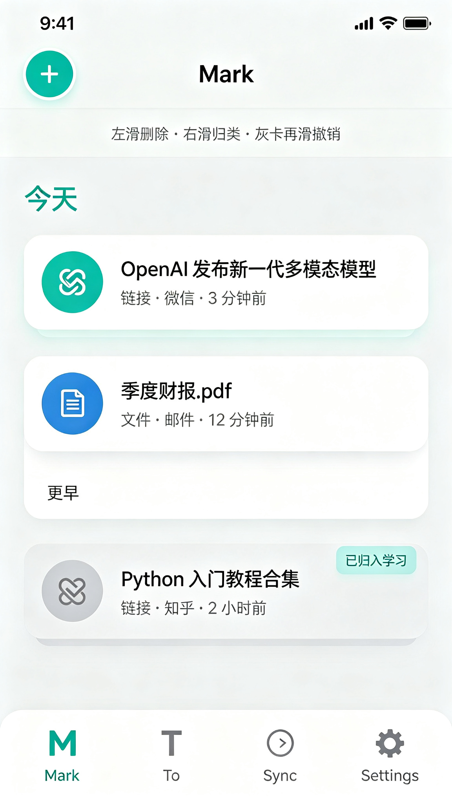
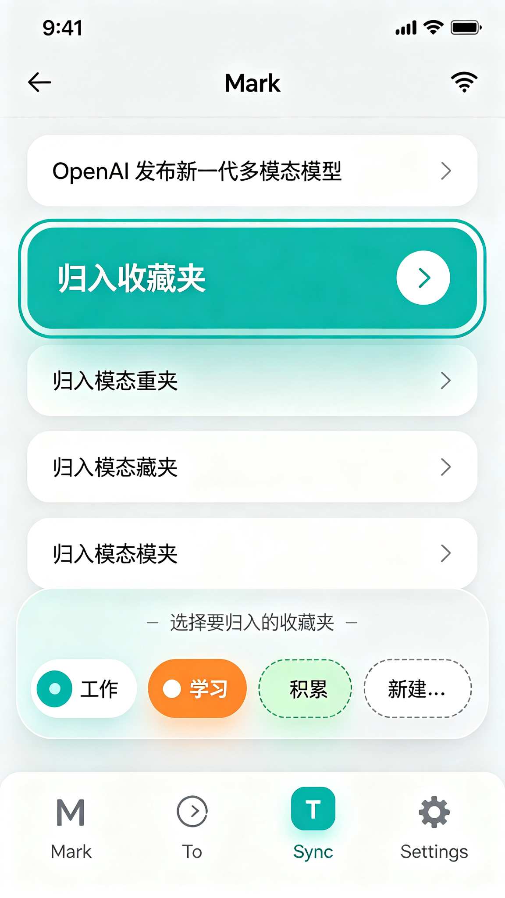
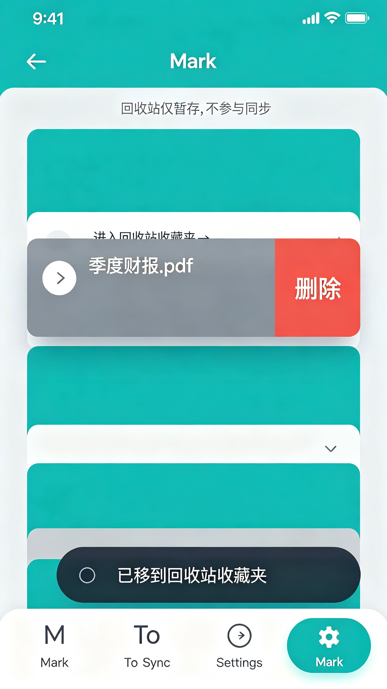
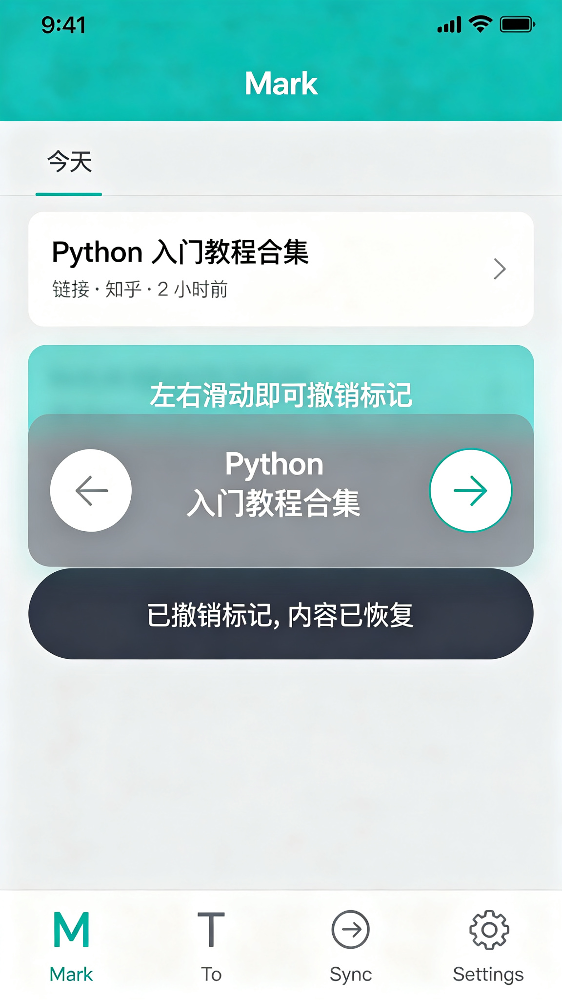
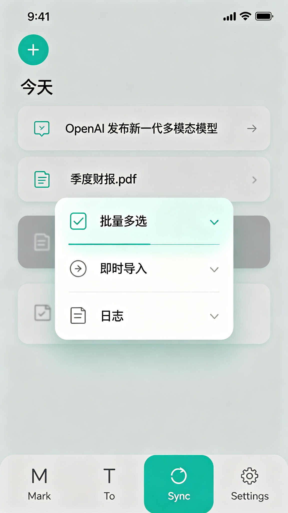
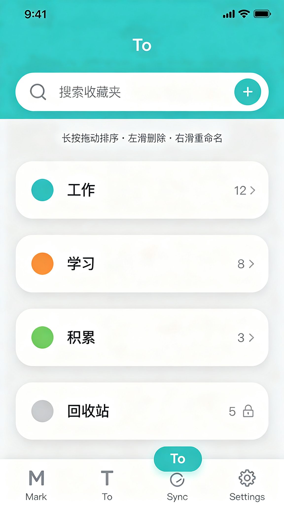
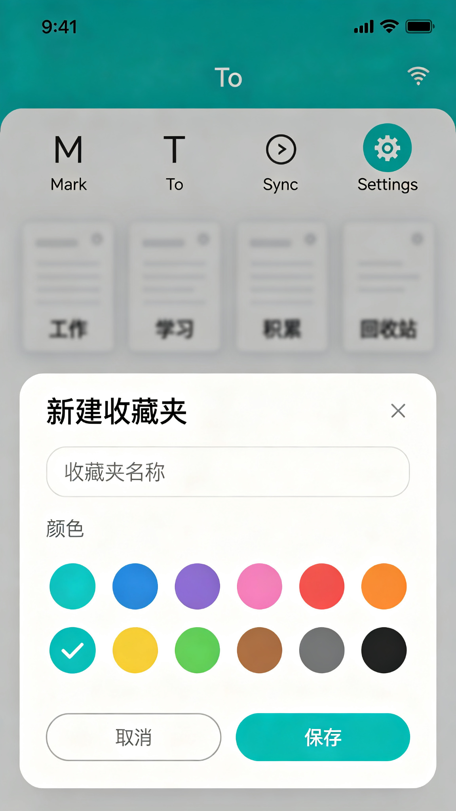
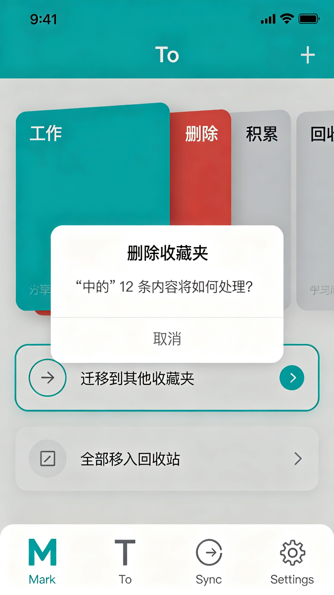
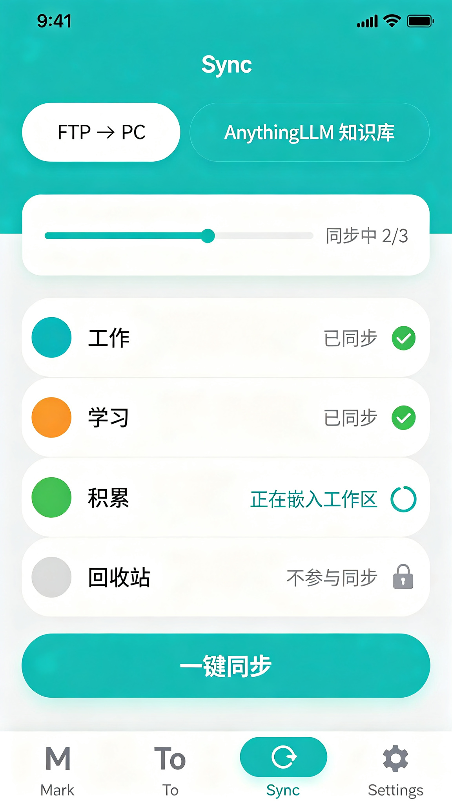
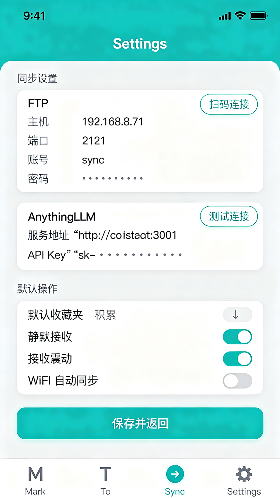

# Mark To (mt) · V1.9 最终设计方案

> 交付版本:v1.9 交互重构 · 设计定稿 | 日期:2026-09-14 | 状态:✅ 已定稿(全部待确认项已答复)
> 产品代号:Mark To(简称 **mt**)| 基线:v1.7.0(AnythingLLM Importer Android)
> 本文件为最终设计交付物,配套文件见文末「交付物清单」。

---

## 1. 产品定位

**把应用从「AnythingLLM 批量导入工具」重塑为「Mark To(mt)」——一个"分享即流式、滑一下即归类"的个人收藏流,配「收藏夹 → FTP / AnythingLLM 双通道同步」。**

- 用户每天从各 APP 分享内容(链接/文件/图片)到 mt,静默收进、零决策;
- 打开 App 流式浏览,左右滑完成归类/删除,灰卡再滑反悔;
- 分类统一为"收藏夹"(名称+颜色),同步时自动在 PC 与 AnythingLLM 建立同名结构并嵌入同名工作区。

**核心操作链路**:分享 → 选 Mark To(静默收进,不打断)→ 打开 Mark 页流式查看 → 右滑弹气泡归入 工作/学习/积累(或左滑删掉)→ 灰卡滑一下反悔 → Sync 一键同步,PC 目录与知识库自动长成收藏夹结构。

---

## 2. 设计定稿要点(决策速览)

| # | 决策项 | 定稿结论 |
|---|---|---|
| Q1 | To 页(收藏夹管理) | 顶层搜索+加号;默认收藏夹 = **工作 / 学习 / 积累 / 回收站**;长按拖动排序;左滑删除(弹迁移选择);右滑重命名 |
| Q2 | 来源 App 显示 | `ClipDescription.label` 尽力获取 + "未知来源"兜底(不做统计权限方案) |
| Q3 | 分类体系 | **收藏夹 = 唯一分类体系**,替代资料库文件夹/知识库文件夹/知识库工作区;每个收藏夹 = 本地缓存文件夹 + 服务器同名文件夹 + 同名工作区;知识库用户文件夹内资料**默认全部嵌入同名工作区** |
| Q4 | 回收站 | **不参与同步**,仅参与标记与暂存文件 |
| Q5 | 删除收藏夹 | 条目去向由用户选择:迁移入其他收藏夹 / 全部移入回收站 |
| Q6 | 右滑气泡 | 仅 1 个可归入夹时直接归入并提示"已存入默认收藏夹";点空白取消保持未标记 |
| Q7 | 批量/导入/日志 | 功能保留,入口收进 **Mark 页左上角"+"** |
| Q8 | 同步触发 | 手动一键 + 可选"WiFi 下自动同步"开关 |
| Q9 | 图片缩略图 | 显示缩略图,控制解码尺寸 |
| Q10 | 旧数据 | 全部保留不删除;旧标记条目按文件夹名迁移到同名收藏夹;服务器端由用户手动清理 |
| Q11 | 预置收藏夹 | 工作/学习/积累 可删除可改名(删除走迁移选择);回收站不可删、不可改名 |
| — | 本地缓存位置 | **用户存储根目录 `MarkTo/{收藏夹名}/`**(便于文件管理器直接查找;需处理 Android 10+ 分区存储) |
| — | 选项卡命名 | **Mark(M 图标)/ To(T 图标)/ Sync(循环箭头)/ Settings(齿轮)** |
| — | Mark 页样式 | **平铺列表卡片式**:卡片留白间隔、完全平铺不叠加 |

---

## 3. 信息架构:四 Tab

| Tab | 名称 | 图标 | 功能 |
|---|---|---|---|
| 1 | **Mark** | 大写字母 M | 流式收件箱:分享内容流式展示 + 左右滑手势整理 |
| 2 | **To** | 大写字母 T | 收藏夹管理:新建/改名/改色/排序/删除/回收站 |
| 3 | **Sync** | 循环箭头 | 双通道同步:FTP → PC / AnythingLLM 知识库 |
| 4 | **Settings** | 齿轮 | 同步设置 + 默认操作 + 高级参数 |

当前页图标以**青绿色实底圆角胶囊**高亮,未选中为灰色。

---

## 4. 页面级设计(10 张预览图 + 详细说明)

> 以下预览图为设计示意稿(9:16 竖版),开发实现以本文件文字说明为准。

### 4.1 Mark · 流式收件箱(预览图 01)



**界面结构**
- 顶部应用栏:左上角圆形"+"按钮(批量/即时导入/日志入口),居中标题 **Mark**;
- 内容区:**平铺列表卡片式**,卡片之间留有清晰均匀间隔,完全平铺不叠加、无堆叠阴影;
- 列表逻辑:未标记(白卡)在前按接收时间倒序 → 已标记/已回收(灰卡)在后按标记时间倒序;顶部"今天 / 更早"轻量分组。

**卡片信息**
- 左侧类型图标(链接=青绿底、文件=蓝底);
- 标题(链接=网页标题、文件=文件名、图片=文件名+缩略图);
- 副行:`类型 · 来源 App · 相对时间`(如"链接 · 微信 · 3 分钟前");
- 灰卡右上角"已归入[收藏夹]"小标签;灰卡整体灰色半透明。

**顶部提示条**:"左滑删除 · 右滑归类 · 灰卡再滑撤销"。

---

### 4.2 Mark · 右滑归类 → 收藏夹气泡(预览图 02)



**操作流(两段式)**
1. 白卡**右滑**约 1/3 → 卡片左侧露出青绿色操作底"归入收藏夹",卡片边框青绿色高亮(待选态);
2. 底部弹出**半透明毛玻璃气泡条**:横向胶囊 = 收藏夹色点+名称(工作/学习/积累/自定义),按常用度排序,**不含回收站**;另附虚线"新建…";
3. 点击某胶囊 → 条目归入该夹,变灰沉底 + 提示"已归入[夹]";
4. 气泡上方提示"选择要归入的收藏夹";**点空白取消 → 保持未标记**。

**边界规则(Q6)**
- 仅 1 个可归入用户夹 → 不弹气泡,直接归入 + 提示"已存入默认收藏夹";
- 0 个用户夹 → 引导去 To 页新建。

---

### 4.3 Mark · 左滑删除 → 回收站(预览图 03)



**操作流**
1. 白卡**左滑**约 1/3 → 卡片右侧露出灰红色操作底"删除",卡片主体转灰;
2. 条目进入 **TRASHED** 状态:归入回收站收藏夹,变灰沉底;
3. 底部 Snackbar:"已移到回收站收藏夹";
4. 语义说明:回收站仅暂存,不参与同步(Q4)。

---

### 4.4 Mark · 灰卡双滑撤销(预览图 04)



**操作流**
1. 灰卡(已标记/已回收)居中放大,卡片左右各一个圆形箭头按钮(← / →);
2. 卡片上半部提示条:"左右滑动即可撤销标记";
3. **左滑或右滑均触发撤销**(Q6:双向同义),恢复 `PENDING` 白卡回到未标记区;
4. Snackbar:"已撤销标记,内容已恢复"。

**灰色撤销覆盖两种状态**:已归入收藏夹(MARKED)与已回收(TRASHED)均可撤销。

---

### 4.5 Mark · 左上角"+"菜单(预览图 05)



- 左上角"+"按钮 → 下拉菜单三入口(Q7):
  1. **批量多选**(进阶:勾选批量标记/删除);
  2. **即时导入**(原有导入向导);
  3. **日志**(导入/同步记录)。

---

### 4.6 To · 收藏夹管理列表(预览图 06)



**界面结构**
- 顶部:圆角搜索框"搜索收藏夹"+ 右侧青绿色圆形"+"按钮;
- 提示条:"长按拖动排序 · 左滑删除 · 右滑重命名";
- 收藏夹卡片(平铺列表):左侧色点 + 名称 + 右侧条目数徽标 + 右箭头;默认四个:**工作(蓝)12 / 学习(橙)8 / 积累(绿)3 / 回收站(灰)5(带锁图标)**。

**交互规则(Q1)**
| 操作 | 行为 |
|---|---|
| 点加号 | 新建收藏夹(名称+12 色)→ 保存入列 |
| 长按拖动 | 排序,松手落位(影响气泡顺序与同步遍历顺序) |
| 左滑卡片 | 删除收藏夹 → 迁移选择框(Q5) |
| 右滑卡片 | 重命名(名称+颜色) |
| 点卡片 | 进入收藏夹详情:条目列表 → 点条目可移出(选夹)/彻底删除 |
| 回收站 | 查看 / 清空(彻底删除文件副本) |

---

### 4.7 To · 新建收藏夹(预览图 07)



- 底部弹出对话框:标题"新建收藏夹";
- 名称输入框(占位"收藏夹名称");
- **12 色选择器**:青蓝/蓝/紫/粉/红/橙/黄/绿/青/棕/灰/黑,选中色块带对勾;
- 底部按钮:"取消"(灰描边)/"保存"(青绿实底)。

---

### 4.8 To · 删除收藏夹 → 迁移选择(预览图 08)



**操作流(Q5)**
1. 收藏夹卡片左滑 → 露出红色"删除"底;
2. 弹出居中对话框:"删除收藏夹 / "「工作」中的 12 条内容将如何处理?";
3. 两个选项(单选):
   - **迁移到其他收藏夹**(选中态青绿描边)→ 选择目标夹 → 条目全部移入;
   - **全部移入回收站**;
4. 底部"取消"。

---

### 4.9 Sync · 同步页(预览图 09)



**界面结构**
- 顶部双子选项卡:**FTP → PC** / **AnythingLLM 知识库**(当前选中态青绿实底);
- 进度卡片:细进度条 + "同步中 2/3";
- 收藏夹同步状态列表(平铺):每行 = 色点 + 名称 + 状态;
  - 工作 ✓ 已同步 / 学习 ✓ 已同步 / 积累 ◌ 正在嵌入工作区 / **回收站 🔒 不参与同步**;
- 底部全宽主按钮"**一键同步**"(青绿实底)。

**同步机制(Q3/Q8)**
- 手动一键 + 可选"WiFi 下自动同步"开关;
- **通道 A · FTP**:遍历收藏夹(排除回收站)→ PC 建立同名目录树 → 文件副本 + 链接 `.url`(增量判定/失败重试/幂等覆盖);
- **通道 B · AnythingLLM**:对每个收藏夹 ensure 同名服务器文件夹 + 同名工作区 → 文件上传并**默认嵌入同名工作区**;链接走 `upload-link` + 加入同名工作区 → 回写 EXECUTED;
- 收藏夹改名/删除 → 服务器端**不联动删除/重命名**(防误删,只同步新增与内容)。

---

### 4.10 Settings · 设置页(预览图 10)



**界面结构(纵向分区)**
- **板块1 · 同步设置**:
  - FTP 卡:主机/端口/账号/密码 + "扫码连接"(PC 端二维码自动回填)+ 手动输入;
  - AnythingLLM 卡:服务地址/API Key + "测试连接"(手动输入;扫码暂不做);
- **板块2 · 默认操作**:
  - 默认收藏夹(右滑"仅一夹直入"目标,下拉选择);
  - 静默接收(开)/ 接收震动(开)/ WiFi 自动同步(关);
- 底部全宽"**保存并返回**"。
- 高级参数(折叠):超时/并发/文件名策略/重复动作/主题等,原样保留。

---

## 5. 交互与手势规范汇总

| 场景 | 手势/操作 | 结果 |
|---|---|---|
| Mark 白卡 | 左滑 | 删除 → 回收站收藏夹(TRASHED,灰卡沉底 + Snackbar) |
| Mark 白卡 | 右滑 | 弹收藏夹气泡 → 点选归入(MARKED,灰卡沉底 + 提示) |
| Mark 白卡 | 单击 | 弹收藏夹气泡(快速归类) |
| Mark 灰卡 | 左滑 / 右滑 | 撤销标记 → 恢复白卡回未标记区 |
| Mark 灰卡 | 单击 | 弹气泡(改夹) |
| Mark | 左上角"+" | 批量多选 / 即时导入 / 日志 |
| To 卡片 | 长按拖动 | 排序(sortOrder 持久化) |
| To 卡片 | 左滑 | 删除收藏夹 → 迁移选择(迁他夹/入回收站) |
| To 卡片 | 右滑 | 重命名(名称+颜色) |
| To 加号 | 单击 | 新建收藏夹(名称+12 色) |
| Sync | 单击"一键同步" | 双子选项卡各自通道执行 + 进度 + 失败可重试 |

**排序规则(流式)**:未标记(白卡)在前按 `collectedAt` 倒序;已标记/已回收(灰卡)在后按 `markedAt` 倒序;排序/位移使用 `animateItemPlacement()` 回弹。

---

## 6. 数据模型

```
FavoriteFolder(id, name, color: ARGB, builtin: Boolean, sortOrder: Int, createdAt)
  种子:工作 / 学习 / 积累(可删可改名)/ 回收站(builtin,不可删)
  存储:favorites.json(独立 JSON,可单测)

CollectEntry(现有扩展)
  markFolder: String?  → markFolderId: String?(收藏夹 id)
  + markedAt: String?     标记时间(灰卡排序/展示)
  + sourceApp: String?    来源 App(ClipDescription 尽力获取,未知兜底)
  EntryStatus + TRASHED   左滑删除 = 进回收站(灰卡、可撤销、不参与同步)
```

**本地缓存路径**:用户存储根目录 `MarkTo/{收藏夹名}/`(文件副本;链接暂存元数据)。

**旧数据迁移(Q10)**:全部保留;旧 `markFolder` 条目按文件夹名自动建同名收藏夹迁移;服务器端由用户手动清理。

---

## 7. 已核对的技术事实

- AnythingLLM API 已具备:`workspace/new`、`document/create-folder`、`document/upload/{folder}`、`document/upload-link`、`workspace/{slug}/update-embeddings` — 自动建同名文件夹/工作区无需新增后端能力。
- v1.7 已验证手势方案可复用:`SwipeToDismissBox` + `confirmValueChange=false` + `animateItemPlacement`(见 `DOC/4,0界面美化/13-v1.7收件箱范式实施记录.md`)。
- PC 端 `tools/ftp-server/ftp_server.py` 已支持 FTP 配置二维码输出(可扩展输出 AnythingLLM 配置二维码,默认不做)。

---

## 8. 开发阶段建议(供排期参考)

| 阶段 | 内容 | 估工 |
|---|---|---|
| 1 数据层 | FavoriteFolder 模型+仓库+种子;CollectEntry 扩展;MarkTo 根目录存储(分区存储授权);旧数据迁移;单测 | 1.5–2 人日 |
| 2 Mark 页 | 平铺列表卡片/时间·内容·来源/左右滑手势/收藏夹气泡(含"已存入"提示)/灰卡撤销/排序/左上角"+" | 2–2.5 人日 |
| 3 To + Settings | 收藏夹管理(搜索/加号/拖动排序/左删右改名/迁移选择/详情);设置重组(板块1+板块2);品牌 Mark To | 2–2.5 人日 |
| 4 Sync | FTP 收藏夹结构;AnythingLLM 自动建夹/工作区+默认嵌入;WiFi 自动同步;编排重构 | 1.5–2 人日 |
| 5 回归 | 单测全绿 + 模拟器端到端 + 真机手势(滑动阈值/气泡/震动/拖动排序) | 1 人日 |
| **合计** | | **约 8–10 人日** |

---

## 9. 交付物清单

| 文件 | 说明 |
|---|---|
| `MarkTo-V1.9-最终设计方案.md` | 本文档:定稿决策 + 10 屏详解 + 手势/数据/同步规范 |
| `01-Mark流式收件箱.png` ~ `10-Settings设置页.png` | 10 张页面预览图(9:16,设计示意稿) |
| `V1.9-方案总览配图.html` | 四 Tab 架构 + 手势状态机 + 双通道同步映射总览(浏览器打开) |
| `V1.9-用户操作逻辑图.html` | 交互式逻辑图:点 Tab 查看各页"点哪一步 → 显示什么"(浏览器打开) |

**上游过程文档**(如需追溯):`DOC/5.0V1.9交互重构/14-v1.9交互重构方案.md`(Q1–Q11 逐条记录)。

---

> 本方案为设计定稿。如对预览图细节(如 02 气泡文案、03 导航栏)需要逐像素级修正稿,可在进入编码前提出;编码实现以本文档文字规范为准。
